# Последний фонарщик — архитектурный проект

> Milestone 2. Здесь описаны классы и структуры, состояние мира (world state), алгоритм основного игрового цикла и реализация механик, всё с UML-диаграммами. Сам геймдизайн — в [GDD.md](GDD.md).

| | |
|---|---|
| **Версия** | 1.0 — Milestone 2 |
| **Дата** | 23.09.2026 |
| **Авторы** | Бабкин Д.А. (504727), Стефановский Е.А. (467600) |
| **Язык и стандарт** | C++17, CMake ≥ 3.16 |
| **Нотация** | UML в синтаксисе Mermaid (GitHub рисует диаграммы прямо в документе) |

**Как читать диаграммы.** Диаграммы классов и последовательностей нарисованы в стандартной UML-нотации. Диаграммы деятельности (activity) нарисованы через Mermaid `flowchart`, но по правилам UML:

- ● — начальный узел, ◉ — конечный узел;
- прямоугольник со скруглёнными углами — действие;
- ромб — ветвление или слияние;
- подписи на стрелках — сторожевые условия `[условие]`.

На диаграммах классов показаны ключевые поля и методы. Служебные геттеры и конструкторы опущены.

## Содержание

1. [Цели и ключевые решения](#1-цели-и-ключевые-решения)
2. [Общая структура](#2-общая-структура)
3. [Модель данных: определения](#3-модель-данных-определения)
4. [Состояние мира (world state)](#4-состояние-мира-world-state)
5. [Ядро: игровой цикл и состояния игры](#5-ядро-игровой-цикл-и-состояния-игры)
6. [Парсер и команды](#6-парсер-и-команды)
7. [Игровые системы: реализация механик](#7-игровые-системы-реализация-механик)
8. [Интерфейс: консоль и вывод](#8-интерфейс-консоль-и-вывод)
9. [Ошибки, тестирование, отладка](#9-ошибки-тестирование-отладка)
10. [Трассировка: механики GDD → классы](#10-трассировка-механики-gdd--классы)
11. [План реализации (Milestone 3)](#11-план-реализации-milestone-3)

---

## 1. Цели и ключевые решения

### 1.1 Что должна обеспечить архитектура

| Цель | Откуда требование | Как достигается |
|---|---|---|
| Весь контент во внешних файлах | Задание; GDD, раздел 10.2 | Определения (`GameData`) отделены от состояния (`WorldState`). Загадки описаны данными и исполняются интерпретатором взаимодействий |
| Баланс настраивается без перекомпиляции | GDD, раздел 8 | Все числа лежат в `GameConfig`, `EnemyDef`, `ItemDef` |
| Тестируемость, включая автоматическое прохождение | GDD, раздел 11.3 | Логика не печатает напрямую (`MessageLog`), случайность приходит через `IRandom`, ввод-вывод — через `IConsole` |
| Кроссплатформенность и кириллица | GDD, раздел 10.5 | Всё платформенное изолировано в `WinConsole` / `PosixConsole` |
| Посильный объём | Команда из 2 человек, один семестр | Без сторонних движков и ECS: простые классы, один поток, пошаговый цикл |

### 1.2 Ключевые решения

| # | Решение | Почему | Отвергнутая альтернатива |
|---|---|---|---|
| 1 | Неизменяемые **определения** (`*Def`) отделены от изменяемого **состояния** (`*State`) | Сохранение — это сериализация одного `WorldState`; данные не дублируются; ссылки легко проверить | Один класс `Room` с изменяемыми полями: сохранение пришлось бы собирать по частям |
| 2 | Режимы игры реализованы паттерном **State**: `IGameState` + 5 реализаций | Меню, исследование, бой и финальные экраны по-разному понимают ввод | Флаги `inCombat`, `inMenu` в одном большом цикле |
| 3 | Команды игрока реализованы паттерном **Command**: парсер → `ParsedCommand` → обработчик из `CommandRegistry` | Новая команда — это новый класс и строка в `commands.json`, остальной код не меняется | Длинная цепочка `if/else` по строкам |
| 4 | Загадки описаны **данными**: условия и эффекты хранятся в `std::variant`, их исполняет `InteractionSystem` | В коде нет ни одной конкретной загадки, новые добавляются без перекомпиляции | Отдельный класс на каждую загадку |
| 5 | Логика пишет в `MessageLog`, а печатает только `Renderer` | Тесты читают сообщения; цвета и перенос строк настраиваются в одном месте | `std::cout` в игровой логике |
| 6 | Случайность приходит через интерфейс `IRandom` | Детерминированные тесты и воспроизводимые прогоны (понадобится для видео в M3) | `rand()` в разных местах кода |
| 7 | Идентификаторы — строки из данных (`"mine_pump"`) | Совпадают с JSON; ошибки получаются понятными | Числовые индексы |
| 8 | Один поток, блокирующий ввод | Игра пошаговая, реального времени нет | Асинхронный ввод, игровой таймер |
| 9 | Системы запрашивают смену режима через `GameContext::request(StateId)` | Бой, смерть или победа могут начаться в глубине любой системы, а решение о переходе принимается в одном месте | Каждая функция возвращает «куда переходить» через все уровни вызовов |

---

## 2. Общая структура

### 2.1 Модули и зависимости

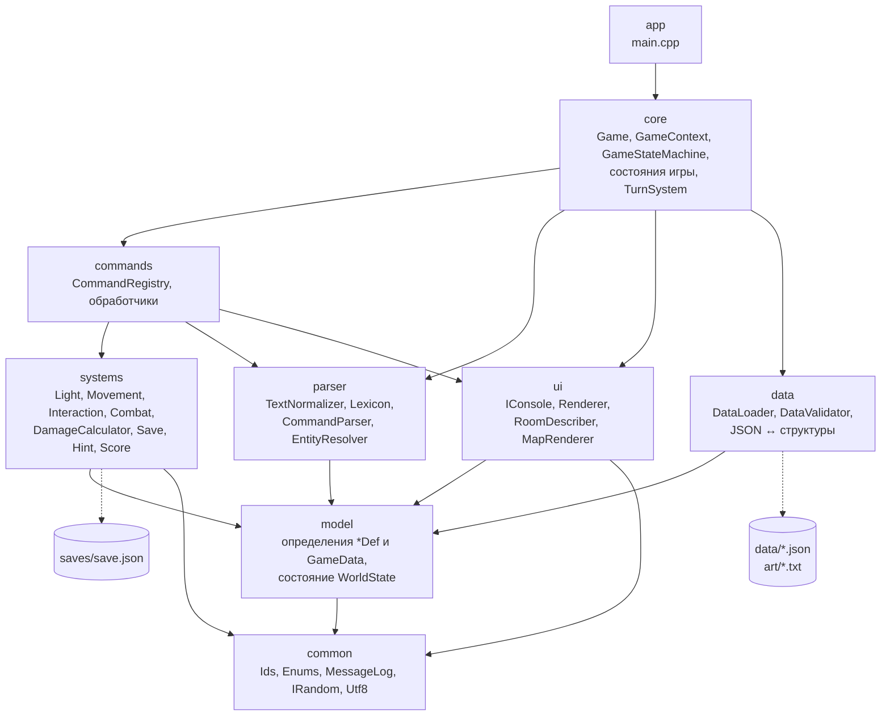
```mermaid
flowchart TB
    APP["app<br/>main.cpp"]
    CORE["core<br/>Game, GameContext, GameStateMachine,<br/>состояния игры, TurnSystem"]
    CMD["commands<br/>CommandRegistry, обработчики"]
    PARSER["parser<br/>TextNormalizer, Lexicon,<br/>CommandParser, EntityResolver"]
    SYS["systems<br/>Light, Movement, Interaction, Combat,<br/>DamageCalculator, Save, Hint, Score"]
    UI["ui<br/>IConsole, Renderer,<br/>RoomDescriber, MapRenderer"]
    DATA["data<br/>DataLoader, DataValidator,<br/>JSON ↔ структуры"]
    MODEL["model<br/>определения *Def и GameData,<br/>состояние WorldState"]
    COMMON["common<br/>Ids, Enums, MessageLog, IRandom, Utf8"]
    FILES[("data/*.json<br/>art/*.txt")]
    SAVES[("saves/save.json")]

    APP --> CORE
    CORE --> CMD
    CORE --> PARSER
    CORE --> UI
    CORE --> DATA
    CMD --> SYS
    CMD --> PARSER
    CMD --> UI
    SYS --> MODEL
    UI --> MODEL
    PARSER --> MODEL
    DATA --> MODEL
    DATA -.-> FILES
    SYS -.-> SAVES
    MODEL --> COMMON
    SYS --> COMMON
    UI --> COMMON
```

**Правила зависимостей:**

- Стрелки идут только вниз: `model` ничего не знает о системах, системы ничего не знают об интерфейсе и парсере.
- `common` — самый нижний слой. На него могут ссылаться все модули.
- С файлами работают только `data` (чтение контента) и `SaveSystem` (сохранения). Консолью владеет только `ui`.
- `GameData` после загрузки доступна только по `const&`. Изменяется только `WorldState`.

### 2.2 Каталоги исходного кода

```
src/
  app/        main.cpp — разбор аргументов командной строки, запуск Game
  core/       Game, GameContext, GameStateMachine, IGameState и 5 состояний, TurnSystem
  commands/   ICommandHandler, CommandRegistry, обработчики команд (~20 классов)
  parser/     TextNormalizer, Lexicon, CommandParser, EntityResolver
  systems/    LightSystem, MovementSystem, InteractionSystem, CombatSystem,
              DamageCalculator, SaveSystem, HintSystem, ScoreSystem, PlayerStats
  model/      определения (RoomDef, ItemDef, EnemyDef, GameConfig, GameData)
              и состояние (WorldState, PlayerState, RoomState, …), WorldFactory
  data/       DataLoader, DataValidator, from_json/to_json для всех структур
  ui/         IConsole, WinConsole, PosixConsole, ScriptedConsole,
              Renderer, RoomDescriber, MapRenderer, StringTable
  common/     Ids.h, Enums.h, MessageLog, IRandom/Random, Utf8
tests/        doctest: парсер, формулы, системы, сценарий прохождения
third_party/  nlohmann/json.hpp, doctest.h
```

### 2.3 Сборка (CMake)

| Цель | Тип | Содержимое |
|---|---|---|
| `lamplighter_core` | статическая библиотека | Всё из `src/`, кроме `app/` |
| `lamplighter` | исполняемый файл | `app/main.cpp` + `lamplighter_core` |
| `lamplighter_tests` | исполняемый файл | `tests/` + `lamplighter_core` |

После сборки папки `data/` и `art/` копируются рядом с исполняемым файлом (команда `add_custom_command POST_BUILD`). Путь к данным можно переопределить флагом `--data`.

---

## 3. Модель данных: определения

Определения — это «база данных» игры. Они загружаются из JSON один раз при запуске и больше не меняются. Код получает их через `const GameData&`.

### 3.1 Диаграмма классов

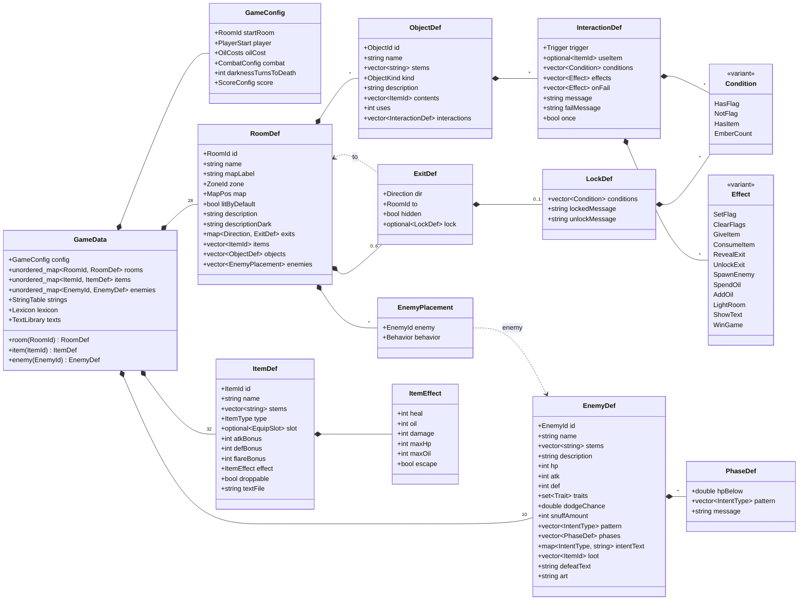
```mermaid
classDiagram
    direction LR
    class GameData {
        +GameConfig config
        +unordered_map~RoomId, RoomDef~ rooms
        +unordered_map~ItemId, ItemDef~ items
        +unordered_map~EnemyId, EnemyDef~ enemies
        +StringTable strings
        +Lexicon lexicon
        +TextLibrary texts
        +room(RoomId) RoomDef
        +item(ItemId) ItemDef
        +enemy(EnemyId) EnemyDef
    }
    class GameConfig {
        +RoomId startRoom
        +PlayerStart player
        +OilCosts oilCost
        +CombatConfig combat
        +int darknessTurnsToDeath
        +ScoreConfig score
    }
    class RoomDef {
        +RoomId id
        +string name
        +string mapLabel
        +ZoneId zone
        +MapPos map
        +bool litByDefault
        +string description
        +string descriptionDark
        +map~Direction, ExitDef~ exits
        +vector~ItemId~ items
        +vector~ObjectDef~ objects
        +vector~EnemyPlacement~ enemies
    }
    class ExitDef {
        +Direction dir
        +RoomId to
        +bool hidden
        +optional~LockDef~ lock
    }
    class LockDef {
        +vector~Condition~ conditions
        +string lockedMessage
        +string unlockMessage
    }
    class EnemyPlacement {
        +EnemyId enemy
        +Behavior behavior
    }
    class ObjectDef {
        +ObjectId id
        +string name
        +vector~string~ stems
        +ObjectKind kind
        +string description
        +vector~ItemId~ contents
        +int uses
        +vector~InteractionDef~ interactions
    }
    class InteractionDef {
        +Trigger trigger
        +optional~ItemId~ useItem
        +vector~Condition~ conditions
        +vector~Effect~ effects
        +vector~Effect~ onFail
        +string message
        +string failMessage
        +bool once
    }
    class Condition {
        <<variant>>
        HasFlag
        NotFlag
        HasItem
        EmberCount
    }
    class Effect {
        <<variant>>
        SetFlag
        ClearFlags
        GiveItem
        ConsumeItem
        RevealExit
        UnlockExit
        SpawnEnemy
        SpendOil
        AddOil
        LightRoom
        ShowText
        WinGame
    }
    class ItemDef {
        +ItemId id
        +string name
        +vector~string~ stems
        +ItemType type
        +optional~EquipSlot~ slot
        +int atkBonus
        +int defBonus
        +int flareBonus
        +ItemEffect effect
        +bool droppable
        +string textFile
    }
    class ItemEffect {
        +int heal
        +int oil
        +int damage
        +int maxHp
        +int maxOil
        +bool escape
    }
    class EnemyDef {
        +EnemyId id
        +string name
        +vector~string~ stems
        +string description
        +int hp
        +int atk
        +int def
        +set~Trait~ traits
        +double dodgeChance
        +int snuffAmount
        +vector~IntentType~ pattern
        +vector~PhaseDef~ phases
        +map~IntentType, string~ intentText
        +vector~ItemId~ loot
        +string defeatText
        +string art
    }
    class PhaseDef {
        +double hpBelow
        +vector~IntentType~ pattern
        +string message
    }

    GameData *-- GameConfig
    GameData *-- "28" RoomDef
    GameData *-- "32" ItemDef
    GameData *-- "10" EnemyDef
    RoomDef *-- "0..6" ExitDef
    ExitDef *-- "0..1" LockDef
    LockDef *-- "*" Condition
    RoomDef *-- "*" ObjectDef
    RoomDef *-- "*" EnemyPlacement
    ObjectDef *-- "*" InteractionDef
    InteractionDef *-- "*" Condition
    InteractionDef *-- "*" Effect
    ItemDef *-- ItemEffect
    EnemyDef *-- "*" PhaseDef
    ExitDef ..> RoomDef : to
    EnemyPlacement ..> EnemyDef : enemy
```

### 3.2 Описание структур

| Структура | Назначение | Ключевые поля |
|---|---|---|
| `GameData` | Корень всех определений; владеет ими | Словари комнат, предметов и врагов; строки интерфейса; словарь парсера; тексты и ASCII-арт |
| `GameConfig` | Числа баланса из `config.json` | Стартовые параметры игрока, стоимость масла, константы боя, порог тьмы, пороги рейтинга |
| `RoomDef` | Комната | Два описания (при свете и в темноте); выходы; стартовые предметы, объекты и враги; `map` — координаты для ASCII-карты; `mapLabel` — короткое имя на карте |
| `ExitDef` | Выход в соседнюю комнату | Направление, цель, признак скрытого выхода, необязательный замок |
| `LockDef` | Условие прохода | Список `Condition`: ключ, флаг «вода ушла», «≥ 2 угля»; сообщения о запертом и отпертом проходе |
| `EnemyPlacement` | Враг, стоящий в конкретной комнате | Ссылка на `EnemyDef` и поведение: утопленник в M3 спит, в M6 нападает сразу |
| `ObjectDef` | Неподвижный объект: стол, насос, жаровня, чаша, эпитафия | Основы слов для парсера; вид (`Plain`, `Container`, `Brazier`, `Readable`); содержимое; число использований; взаимодействия |
| `InteractionDef` | Правило «если игрок сделал X с объектом при условиях Y, то произойдёт Z» | Триггер (`Use`, `Light`, `Open`, `Examine`), нужный предмет, условия, эффекты при успехе и при неудаче, флаг `once` |
| `ItemDef` | Вид предмета | Тип, слот, бонусы к атаке, защите и вспышке, эффект расходника, можно ли выбросить, файл текста записки |
| `EnemyDef` | Вид врага | HP, атака, защита, черты (`Boss`, `Photophobic`, `LightEater`), шанс уклонения, паттерн намерений, фазы босса, тексты намерений, лут, текст после победы |
| `PhaseDef` | Фаза босса | Порог HP, после которого включается новый паттерн, и текст перехода |

Жаровня — это обычный объект с `kind = Brazier` и взаимодействием `Light` → эффекты `SpendOil(10)` и `LightRoom`. Тем самым уточняется пример из GDD (раздел 10.3), где жаровня была флагом комнаты: теперь жаровни, чаши склепа и топка работают через один механизм.

### 3.3 Условия и эффекты взаимодействий

```cpp
// model/Interaction.h
struct HasFlag    { FlagId flag; };
struct NotFlag    { FlagId flag; };
struct HasItem    { ItemId item; };
struct EmberCount { int min; };
using Condition = std::variant<HasFlag, NotFlag, HasItem, EmberCount>;

struct SetFlag     { FlagId flag; };
struct ClearFlags  { std::vector<FlagId> flags; };
struct GiveItem    { ItemId item; int count = 1; };
struct ConsumeItem { ItemId item; int count = 1; };
struct RevealExit  { RoomId room; Direction dir; };
struct UnlockExit  { RoomId room; Direction dir; };
struct SpawnEnemy  { EnemyId enemy; };
struct SpendOil    { int amount; };
struct AddOil      { int amount; };
struct LightRoom   {};
struct ShowText    { std::string text; };
struct WinGame     {};
using Effect = std::variant<SetFlag, ClearFlags, GiveItem, ConsumeItem, RevealExit, UnlockExit,
                            SpawnEnemy, SpendOil, AddOil, LightRoom, ShowText, WinGame>;
```

| Условие | Истинно, когда |
|---|---|
| `HasFlag` / `NotFlag` | Флаг мира установлен / не установлен |
| `HasItem` | Предмет есть в инвентаре |
| `EmberCount` | Углей Сердца в инвентаре не меньше `min` |

| Эффект | Действие |
|---|---|
| `SetFlag`, `ClearFlags` | Установить или снять флаги мира |
| `GiveItem`, `ConsumeItem` | Добавить предмет в инвентарь или убрать из него |
| `RevealExit`, `UnlockExit` | Открыть скрытый выход или отпереть проход |
| `SpawnEnemy` | Создать врага в текущей комнате и начать бой |
| `SpendOil`, `AddOil` | Потратить масло или долить его |
| `LightRoom` | Навсегда осветить текущую комнату |
| `ShowText` | Вывести текст |
| `WinGame` | Запросить переход в состояние `Victory` |

Кроме условий, у взаимодействий есть **автоматические требования**, которые не нужно прописывать в данных. Для триггера `Light` фонарь должен гореть. Для каждого эффекта `SpendOil` масла должно хватать. Если требование не выполнено, игрок получает отказ («Нужно больше масла»), эффекты `onFail` **не** срабатывают, ход не тратится. Так штраф за ошибку в загадке не путается с простой нехваткой ресурса.

**Пример: загадка трёх чаш (C4) целиком в данных**

```json
{ "id": "bowl_faith", "name": "чаша Веры", "stems": ["чаш", "вер"], "kind": "plain",
  "interactions": [ {
    "trigger": "light",
    "conditions": [ { "has_flag": "bowl_memory_lit" }, { "not_flag": "bowl_faith_lit" } ],
    "effects":    [ { "spend_oil": 5 }, { "set_flag": "bowl_faith_lit" } ],
    "message":    "Чаша Веры вспыхивает вслед за чашей Памяти.",
    "on_fail":    [ { "spend_oil": 5 },
                    { "clear_flags": ["bowl_memory_lit", "bowl_faith_lit", "bowl_hope_lit"] },
                    { "spawn_enemy": "wailer" } ],
    "fail_message": "Огонь гаснет, едва коснувшись чаши. Из темноты доносится вой."
  } ] }
```

Чаша Надежды устроена так же. При успехе она дополнительно выполняет `set_flag: fires_solved` и `unlock_exit: {crypt_fires, north}`.

### 3.4 Файлы → структуры

| Файл | Структура | Метод загрузки |
|---|---|---|
| `data/config.json` | `GameConfig` | `DataLoader::loadConfig` |
| `data/world/rooms.json` | `RoomDef` (+ `ExitDef`, `ObjectDef`, `InteractionDef`) | `DataLoader::loadRooms` |
| `data/world/items.json` | `ItemDef` | `DataLoader::loadItems` |
| `data/world/enemies.json` | `EnemyDef` | `DataLoader::loadEnemies` |
| `data/lang/ru/strings.json` | `StringTable` | `DataLoader::loadStrings` |
| `data/lang/ru/commands.json` | `Lexicon` | `DataLoader::loadLexicon` |
| `data/lang/ru/notes/*.txt`, `epilogue/*.txt`, `art/**/*.txt` | `TextLibrary` | `DataLoader::loadTexts` |

Каждая структура разбирается свободной функцией `from_json(const json&, T&)` в модуле `data`. Библиотека nlohmann/json находит эти функции по ADL. Для `Condition` и `Effect` ключ JSON-объекта (`"set_flag"`, `"spend_oil"`, …) определяет, какая альтернатива `std::variant` будет создана.

---

## 4. Состояние мира (world state)

### 4.1 Принцип

**Всё, что меняется во время игры, хранится в одном объекте `WorldState`, и больше нигде.** Определения описывают, каким мир был задуман, а состояние — каким он стал. В `WorldState` хранятся только идентификаторы (`RoomId`, `ItemId`, `EnemyId`), а описания и числа берутся из `GameData`.

Отсюда следует:

- **сохранение** — это сериализация `WorldState` в JSON, **загрузка** — десериализация и проверка идентификаторов;
- **новая игра** — это `WorldFactory::create(data)`, который строит начальное состояние по определениям;
- системы получают `WorldState&` для записи и `const GameData&` только для чтения.

### 4.2 Диаграмма классов

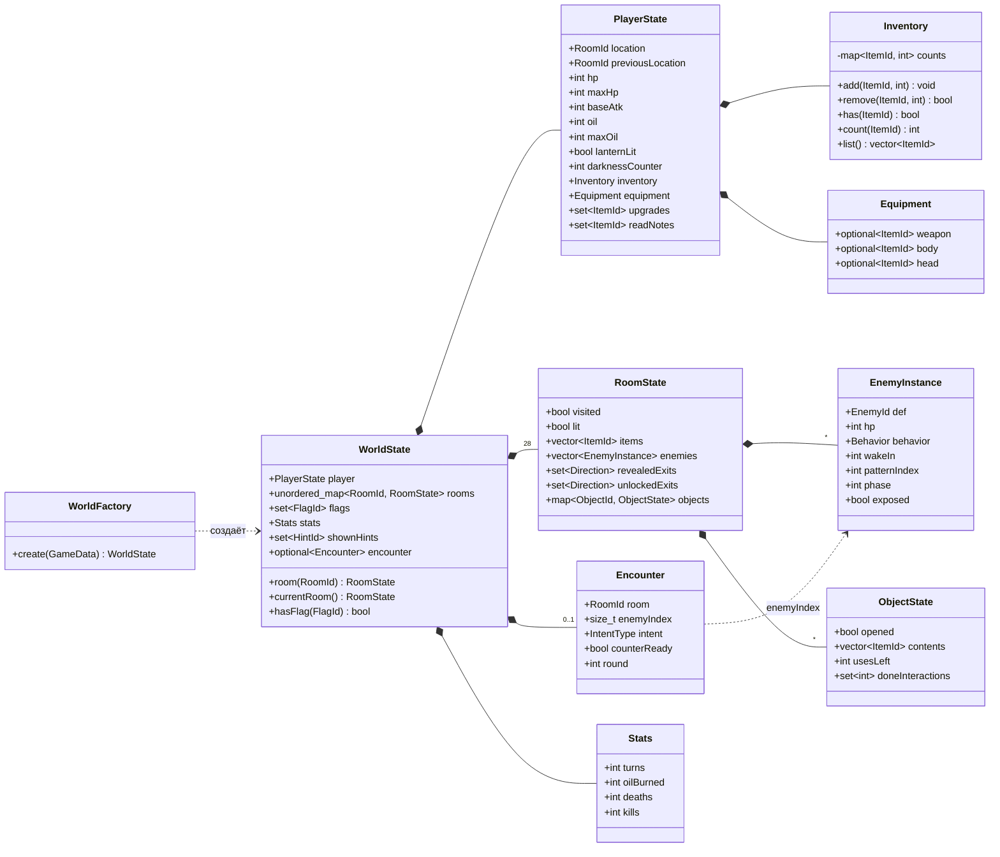
```mermaid
classDiagram
    direction LR
    class WorldState {
        +PlayerState player
        +unordered_map~RoomId, RoomState~ rooms
        +set~FlagId~ flags
        +Stats stats
        +set~HintId~ shownHints
        +optional~Encounter~ encounter
        +room(RoomId) RoomState
        +currentRoom() RoomState
        +hasFlag(FlagId) bool
    }
    class PlayerState {
        +RoomId location
        +RoomId previousLocation
        +int hp
        +int maxHp
        +int baseAtk
        +int oil
        +int maxOil
        +bool lanternLit
        +int darknessCounter
        +Inventory inventory
        +Equipment equipment
        +set~ItemId~ upgrades
        +set~ItemId~ readNotes
    }
    class Inventory {
        -map~ItemId, int~ counts
        +add(ItemId, int) void
        +remove(ItemId, int) bool
        +has(ItemId) bool
        +count(ItemId) int
        +list() vector~ItemId~
    }
    class Equipment {
        +optional~ItemId~ weapon
        +optional~ItemId~ body
        +optional~ItemId~ head
    }
    class RoomState {
        +bool visited
        +bool lit
        +vector~ItemId~ items
        +vector~EnemyInstance~ enemies
        +set~Direction~ revealedExits
        +set~Direction~ unlockedExits
        +map~ObjectId, ObjectState~ objects
    }
    class ObjectState {
        +bool opened
        +vector~ItemId~ contents
        +int usesLeft
        +set~int~ doneInteractions
    }
    class EnemyInstance {
        +EnemyId def
        +int hp
        +Behavior behavior
        +int wakeIn
        +int patternIndex
        +int phase
        +bool exposed
    }
    class Encounter {
        +RoomId room
        +size_t enemyIndex
        +IntentType intent
        +bool counterReady
        +int round
    }
    class Stats {
        +int turns
        +int oilBurned
        +int deaths
        +int kills
    }
    class WorldFactory {
        +create(GameData) WorldState
    }

    WorldState *-- PlayerState
    WorldState *-- "28" RoomState
    WorldState *-- Stats
    WorldState *-- "0..1" Encounter
    PlayerState *-- Inventory
    PlayerState *-- Equipment
    RoomState *-- "*" EnemyInstance
    RoomState *-- "*" ObjectState
    Encounter ..> EnemyInstance : enemyIndex
    WorldFactory ..> WorldState : создаёт
```

### 4.3 Описание структур

```cpp
// model/WorldState.h (сокращённо)
struct EnemyInstance {
    EnemyId  def;
    int      hp;
    Behavior behavior;          // из EnemyPlacement; после пробуждения становится Aggressive
    int      wakeIn = -1;       // −1 — спит спокойно; ≥ 0 — через сколько ходов проснётся
    int      patternIndex = 0;  // позиция в текущем паттерне намерений
    int      phase = 0;         // номер фазы босса (0 — базовый паттерн)
    bool     exposed = false;   // «Раскрыт» после Поглощения: урон ×2 в следующем раунде
};

struct PlayerState {
    RoomId location, previousLocation;   // previousLocation нужна для бегства из боя
    int  hp, maxHp, baseAtk;
    int  oil, maxOil;
    bool lanternLit = true;
    int  darknessCounter = 0;            // ходы подряд без света
    Inventory inventory;
    Equipment equipment;
    std::set<ItemId> upgrades;           // отражатель, большой резервуар
    std::set<ItemId> readNotes;          // для журнала и эпилога Б
};

struct Encounter {                       // существует только во время боя, не сохраняется
    RoomId      room;
    std::size_t enemyIndex;              // индекс в RoomState::enemies
    IntentType  intent;                  // намерение, объявленное на текущий раунд
    bool        counterReady = false;    // следующий удар игрока — контрудар ×1.5
    int         round = 0;
};
```

| Структура | Что хранит | Кто меняет |
|---|---|---|
| `PlayerState` | Положение, HP, масло, фонарь, счётчик тьмы, инвентарь, экипировка, улучшения, прочитанные записки | Все системы и обработчики |
| `RoomState` | Посещена ли комната; освещена ли (жаровня); предметы на полу; живые враги; открытые скрытые и отпертые выходы; состояние объектов | `MovementSystem`, `InteractionSystem`, `CombatSystem`, `TakeHandler`, `DropHandler` |
| `ObjectState` | Открыт ли контейнер; что в нём осталось; сколько раз ещё можно использовать (цистерна: 2); какие одноразовые взаимодействия уже выполнены | `InteractionSystem` |
| `EnemyInstance` | Текущие HP; поведение; счётчик пробуждения; позиция в паттерне; фаза; статус «Раскрыт» | `CombatSystem`, `TurnSystem`, `LightSystem` |
| `Encounter` | Текущий бой: с кем, какое намерение объявлено, готов ли контрудар | `CombatSystem` |
| `flags` | Флаги мира: `pump_fixed`, `lift_powered`, `fires_solved`, `lighteater_defeated`, … | `InteractionSystem`, `CombatSystem` |
| `Stats` | Ходы, сожжённое масло, смерти, убитые враги — для статистики и рейтинга | `TurnSystem`, `LightSystem`, `CombatSystem` |
| `shownHints` | Какие контекстные подсказки уже показаны | `HintSystem` |

«Сердцевина» действует сразу при подборе (`maxHp += 10`, `hp += 10`) и в `upgrades` не попадает: её эффект уже записан в `maxHp`. Производные характеристики — атака, защита, сила вспышки, число углей — не хранятся, их каждый раз вычисляет `PlayerStats` по экипировке и улучшениям.

### 4.4 Инварианты

- `0 ≤ player.oil ≤ player.maxOil` и `0 ≤ player.hp ≤ player.maxHp`.
- `player.lanternLit ⇒ player.oil > 0`: при нуле масла фонарь гаснет в том же вызове `LightSystem`.
- `player.darknessCounter == 0`, если игрок видит (комната освещена или горит фонарь).
- Каждой `RoomDef` соответствует ровно одна `RoomState` с тем же id, и `player.location` — одна из них.
- Предметы с `droppable = false` (фонарь, ключи, угли) не покидают инвентарь.
- `encounter.has_value()` тогда и только тогда, когда активно состояние `CombatState`.
- UI получает `WorldState` только по `const&`.

### 4.5 Жизненный цикл состояния

**Новая игра.** `WorldFactory::create(data)`:

- игрок получает параметры из `config.player` и стоит в `config.startRoom`, в инвентаре фонарь, надета куртка;
- для каждой `RoomDef` создаётся `RoomState`: `lit = litByDefault`, `items` — копия стартовых предметов, `enemies` — экземпляры из `EnemyPlacement` (`hp = def.hp`, `wakeIn = −1`), `objects` — `ObjectState` с копией содержимого и `usesLeft = uses`.

**Сохранение.** `SaveSystem::save` сериализует всё, кроме `encounter` (во время боя сохраняться нельзя):

```json
{
  "version": 1,
  "player": { "location": "mine_pump", "previous": "mine_tracks", "hp": 27, "max_hp": 40,
              "base_atk": 1, "oil": 61, "max_oil": 100, "lantern": true, "darkness": 0,
              "inventory": { "lantern": 1, "pump_handle": 1, "bandage": 2, "oil_flask": 1 },
              "equipment": { "weapon": "miner_pick", "body": "leather_jacket", "head": "miner_helmet" },
              "upgrades": [], "notes": ["note_orin", "note_charter", "note_miner"] },
  "flags": ["gatehouse_unlocked"],
  "rooms": {
    "gatehouse": { "visited": true, "lit": true, "items": [], "enemies": [],
                   "revealed": [], "unlocked": ["north"],
                   "objects": { "desk": { "opened": true, "contents": [], "uses": -1, "done": [] } } },
    "mine_bunkhouse": { "visited": true, "lit": false, "items": ["tonic"],
                        "enemies": [ { "def": "drowned", "hp": 16, "behavior": "sleeping",
                                       "wake_in": -1, "pattern": 0, "phase": 0, "exposed": false } ],
                        "revealed": ["east"], "unlocked": [], "objects": {} }
  },
  "stats": { "turns": 143, "oil_burned": 87, "deaths": 0, "kills": 5 },
  "hints": ["first_dark_room", "first_combat"]
}
```

**Загрузка.** Разбираем JSON, проверяем `version`, затем проверяем, что каждый id существует в `GameData`. Результат присваивается **тому же** объекту `WorldState` (`world = std::move(loaded)`), поэтому ссылки в `GameContext` остаются валидными. Повреждённый файл не ломает текущую игру: выводится «Сохранение повреждено», состояние не меняется.

---

## 5. Ядро: игровой цикл и состояния игры

### 5.1 Диаграмма классов

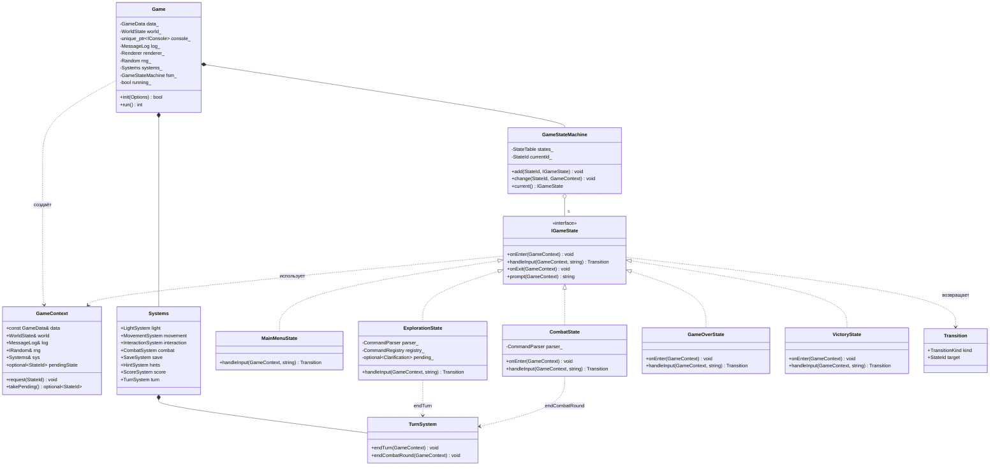
```mermaid
classDiagram
    direction TB
    class Game {
        -GameData data_
        -WorldState world_
        -unique_ptr~IConsole~ console_
        -MessageLog log_
        -Renderer renderer_
        -Random rng_
        -Systems systems_
        -GameStateMachine fsm_
        -bool running_
        +init(Options) bool
        +run() int
    }
    class GameContext {
        +const GameData& data
        +WorldState& world
        +MessageLog& log
        +IRandom& rng
        +Systems& sys
        +optional~StateId~ pendingState
        +request(StateId) void
        +takePending() optional~StateId~
    }
    class Systems {
        +LightSystem light
        +MovementSystem movement
        +InteractionSystem interaction
        +CombatSystem combat
        +SaveSystem save
        +HintSystem hints
        +ScoreSystem score
        +TurnSystem turn
    }
    class GameStateMachine {
        -StateTable states_
        -StateId currentId_
        +add(StateId, IGameState) void
        +change(StateId, GameContext) void
        +current() IGameState
    }
    class IGameState {
        <<interface>>
        +onEnter(GameContext) void
        +handleInput(GameContext, string) Transition
        +onExit(GameContext) void
        +prompt(GameContext) string
    }
    class MainMenuState {
        +handleInput(GameContext, string) Transition
    }
    class ExplorationState {
        -CommandParser parser_
        -CommandRegistry registry_
        -optional~Clarification~ pending_
        +handleInput(GameContext, string) Transition
    }
    class CombatState {
        -CommandParser parser_
        +onEnter(GameContext) void
        +handleInput(GameContext, string) Transition
    }
    class GameOverState {
        +onEnter(GameContext) void
        +handleInput(GameContext, string) Transition
    }
    class VictoryState {
        +onEnter(GameContext) void
        +handleInput(GameContext, string) Transition
    }
    class Transition {
        +TransitionKind kind
        +StateId target
    }
    class TurnSystem {
        +endTurn(GameContext) void
        +endCombatRound(GameContext) void
    }

    IGameState <|.. MainMenuState
    IGameState <|.. ExplorationState
    IGameState <|.. CombatState
    IGameState <|.. GameOverState
    IGameState <|.. VictoryState
    Game *-- GameStateMachine
    Game *-- Systems
    Game ..> GameContext : создаёт
    GameStateMachine o-- "5" IGameState
    Systems *-- TurnSystem
    IGameState ..> Transition : возвращает
    IGameState ..> GameContext : использует
    ExplorationState ..> TurnSystem : endTurn
    CombatState ..> TurnSystem : endCombatRound
```

```cpp
// core/IGameState.h
enum class TransitionKind { None, Change, Quit };
struct Transition { TransitionKind kind = TransitionKind::None; StateId target{}; };

class IGameState {
public:
    virtual ~IGameState() = default;
    virtual void onEnter(GameContext&) {}
    virtual Transition handleInput(GameContext& ctx, const std::string& line) = 0;
    virtual void onExit(GameContext&) {}
    virtual std::string prompt(const GameContext&) const { return "> "; }
};

// core/GameContext.h — «рюкзак» ссылок, который передаётся в каждый вызов
struct GameContext {
    const GameData& data;
    WorldState&     world;
    MessageLog&     log;
    IRandom&        rng;
    Systems&        sys;
    std::optional<StateId> pendingState;   // запрос смены режима от систем
    void request(StateId s);               // приоритет: GameOver > Victory > Combat
    std::optional<StateId> takePending();  // забрать запрос и очистить его
};
```

| Класс | Ответственность |
|---|---|
| `Game` | Владеет всеми объектами (данные, состояние, системы, консоль), загружает данные, крутит главный цикл |
| `GameContext` | Набор ссылок на данные, состояние, лог, генератор случайных чисел и системы, которые нужны каждому обработчику. Здесь же хранится отложенный запрос перехода |
| `GameStateMachine` | Хранит 5 состояний и текущее; при смене вызывает `onExit` старого и `onEnter` нового |
| `MainMenuState` | Меню: «Новая игра» (`ctx.newGame()` → `WorldFactory`), «Продолжить» (`SaveSystem::load`), «Об игре», «Выход» |
| `ExplorationState` | Разбирает команду, вызывает обработчик, завершает ход, превращает запросы систем в переходы. Хранит уточняющий вопрос парсера («Какой ключ?») |
| `CombatState` | Разбирает боевые команды и передаёт их в `CombatSystem`; при входе показывает портрет врага и подсказку по командам |
| `GameOverState` | Экран «Фонарь погас»: загрузить / новая игра / выход в меню. Увеличивает `stats.deaths` |
| `VictoryState` | Финальная сцена, эпилог А или Б, статистика, рейтинг |
| `TurnSystem` | Всё, что происходит в конце хода (см. [5.5](#55-конец-хода-turnsystem)) |

### 5.2 Машина состояний игры

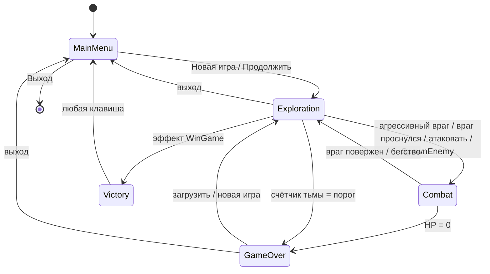
```mermaid
stateDiagram-v2
    state "MainMenu" as MainMenu
    state "Exploration" as Exploration
    state "Combat" as Combat
    state "GameOver" as GameOver
    state "Victory" as Victory

    [*] --> MainMenu
    MainMenu --> Exploration : Новая игра / Продолжить
    MainMenu --> [*] : Выход
    Exploration --> Combat : агрессивный враг / враг проснулся / атаковать / SpawnEnemy
    Combat --> Exploration : враг повержен / бегство
    Combat --> GameOver : HP = 0
    Exploration --> GameOver : счётчик тьмы = порог
    Exploration --> Victory : эффект WinGame
    Exploration --> MainMenu : выход
    GameOver --> Exploration : загрузить / новая игра
    GameOver --> MainMenu : выход
    Victory --> MainMenu : любая клавиша
```

### 5.3 Главный игровой цикл

```cpp
int Game::run() {
    GameContext ctx{data_, world_, log_, rng_, systems_};
    fsm_.change(StateId::MainMenu, ctx);
    while (running_) {
        renderer_.flush(log_, *console_);                  // 1. вывести накопленные сообщения
        console_->write(fsm_.current().prompt(ctx));        // 2. приглашение «> »
        std::optional<std::string> line = console_->readLine();  // 3. блокирующее чтение
        if (!line) break;                                   //    конец ввода (Ctrl+Z / Ctrl+D)
        Transition t = fsm_.current().handleInput(ctx, *line);   // 4. обработка текущим режимом
        if (t.kind == TransitionKind::Change) fsm_.change(t.target, ctx);  // 5. смена режима
        if (t.kind == TransitionKind::Quit)   running_ = false;
    }
    renderer_.flush(log_, *console_);
    return 0;
}
```

**Диаграмма деятельности: главный цикл**

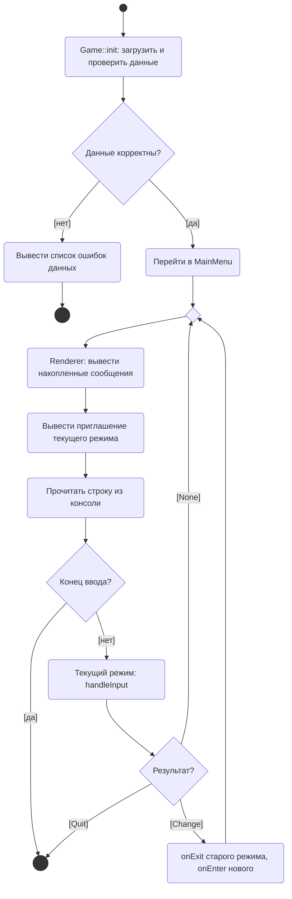
```mermaid
flowchart TD
    s((" ")):::startNode --> init("Game::init: загрузить и проверить данные")
    init --> ok{"Данные корректны?"}
    ok -- "[нет]" --> err("Вывести список ошибок данных")
    err --> e1(((" "))):::endNode
    ok -- "[да]" --> menu("Перейти в MainMenu")
    menu --> m1{" "}
    m1 --> flush("Renderer: вывести накопленные сообщения")
    flush --> prompt("Вывести приглашение текущего режима")
    prompt --> read("Прочитать строку из консоли")
    read --> eof{"Конец ввода?"}
    eof -- "[да]" --> e2(((" "))):::endNode
    eof -- "[нет]" --> handle("Текущий режим: handleInput")
    handle --> kind{"Результат?"}
    kind -- "[Change]" --> change("onExit старого режима, onEnter нового")
    kind -- "[Quit]" --> e2
    kind -- "[None]" --> m1
    change --> m1

    classDef startNode fill:#333,stroke:#333,color:#333
    classDef endNode fill:#333,stroke:#333,color:#333
```

### 5.4 Обработка команды в режиме исследования

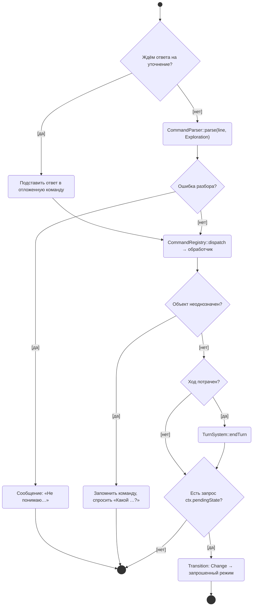
```mermaid
flowchart TD
    s((" ")):::startNode --> clar{"Ждём ответа на уточнение?"}
    clar -- "[да]" --> merge("Подставить ответ в отложенную команду")
    clar -- "[нет]" --> parse("CommandParser::parse(line, Exploration)")
    merge --> dispatch
    parse --> perr{"Ошибка разбора?"}
    perr -- "[да]" --> msg("Сообщение: «Не понимаю…»")
    msg --> none(((" "))):::endNode
    perr -- "[нет]" --> dispatch("CommandRegistry::dispatch → обработчик")
    dispatch --> amb{"Объект неоднозначен?"}
    amb -- "[да]" --> ask("Запомнить команду, спросить «Какой …?»")
    ask --> none
    amb -- "[нет]" --> turn{"Ход потрачен?"}
    turn -- "[да]" --> et("TurnSystem::endTurn")
    turn -- "[нет]" --> pend
    et --> pend{"Есть запрос ctx.pendingState?"}
    pend -- "[да]" --> tr("Transition: Change → запрошенный режим")
    pend -- "[нет]" --> none
    tr --> fin(((" "))):::endNode

    classDef startNode fill:#333,stroke:#333,color:#333
    classDef endNode fill:#333,stroke:#333,color:#333
```

Система может запросить смену режима в любой момент обработки:

- `MovementSystem` — когда игрок входит к агрессивному врагу;
- `InteractionSystem` — эффекты `SpawnEnemy` и `WinGame`;
- `TurnSystem` — смерть во тьме или проснувшийся враг.

Все запросы собираются в `ctx.pendingState`, а переход выполняется **один раз**, после конца хода. Если запросов несколько, выбирается самый важный: `GameOver` > `Victory` > `Combat`.

### 5.5 Конец хода (TurnSystem)

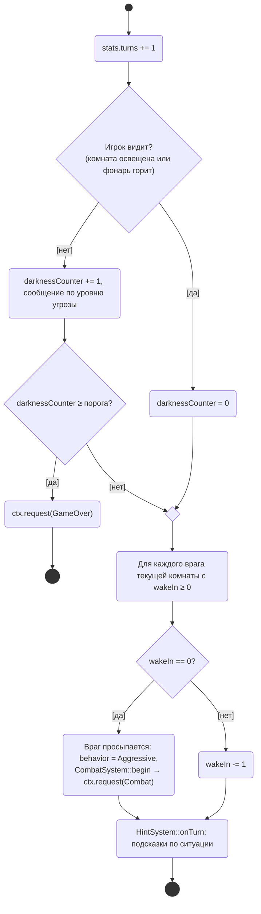
```mermaid
flowchart TD
    s((" ")):::startNode --> t1("stats.turns += 1")
    t1 --> see{"Игрок видит?<br/>(комната освещена или фонарь горит)"}
    see -- "[да]" --> reset("darknessCounter = 0")
    see -- "[нет]" --> inc("darknessCounter += 1, сообщение по уровню угрозы")
    inc --> dead{"darknessCounter ≥ порога?"}
    dead -- "[да]" --> go("ctx.request(GameOver)")
    go --> e1(((" "))):::endNode
    dead -- "[нет]" --> m1{" "}
    reset --> m1
    m1 --> loop("Для каждого врага текущей комнаты с wakeIn ≥ 0")
    loop --> w0{"wakeIn == 0?"}
    w0 -- "[да]" --> wake("Враг просыпается: behavior = Aggressive,<br/>CombatSystem::begin → ctx.request(Combat)")
    w0 -- "[нет]" --> dec("wakeIn -= 1")
    wake --> hints
    dec --> hints("HintSystem::onTurn: подсказки по ситуации")
    hints --> e2(((" "))):::endNode

    classDef startNode fill:#333,stroke:#333,color:#333
    classDef endNode fill:#333,stroke:#333,color:#333
```

`endCombatRound` — облегчённая версия для боя: увеличивает `stats.turns` и не трогает счётчик тьмы. По GDD (раздел 3.3) в бою тьма не убивает, вместо этого действуют штрафы боя в темноте.

### 5.6 Диаграмма последовательности: запуск игры

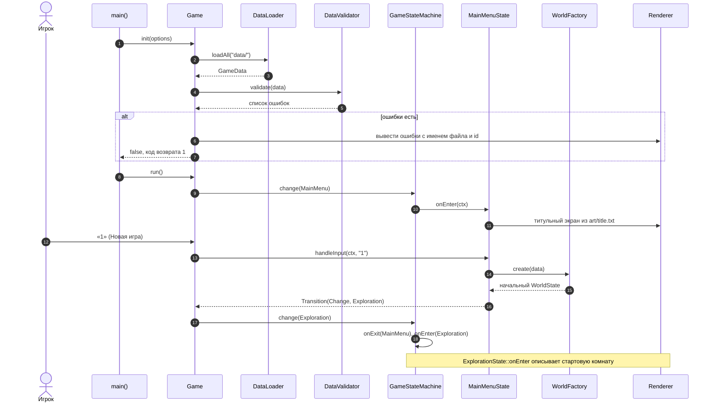
```mermaid
sequenceDiagram
    autonumber
    actor P as Игрок
    participant M as main()
    participant G as Game
    participant L as DataLoader
    participant V as DataValidator
    participant F as GameStateMachine
    participant MM as MainMenuState
    participant WF as WorldFactory
    participant R as Renderer

    M->>G: init(options)
    G->>L: loadAll("data/")
    L-->>G: GameData
    G->>V: validate(data)
    V-->>G: список ошибок
    alt ошибки есть
        G->>R: вывести ошибки с именем файла и id
        G-->>M: false, код возврата 1
    end
    M->>G: run()
    G->>F: change(MainMenu)
    F->>MM: onEnter(ctx)
    MM->>R: титульный экран из art/title.txt
    P->>G: «1» (Новая игра)
    G->>MM: handleInput(ctx, "1")
    MM->>WF: create(data)
    WF-->>MM: начальный WorldState
    MM-->>G: Transition(Change, Exploration)
    G->>F: change(Exploration)
    F->>F: onExit(MainMenu), onEnter(Exploration)
    Note over F,R: ExplorationState::onEnter описывает стартовую комнату
```

---

## 6. Парсер и команды

### 6.1 Диаграмма классов

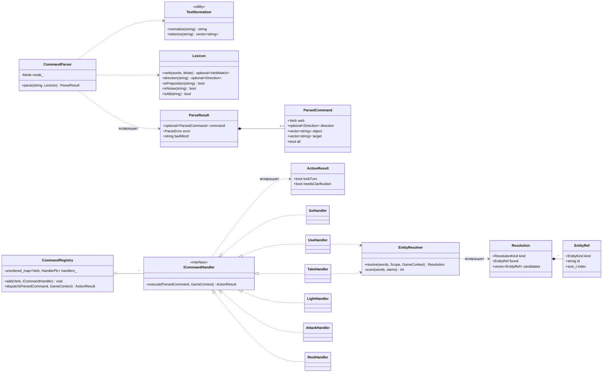
```mermaid
classDiagram
    direction LR
    class TextNormalizer {
        <<utility>>
        +normalize(string) string
        +tokenize(string) vector~string~
    }
    class Lexicon {
        +verb(words, Mode) optional~VerbMatch~
        +direction(string) optional~Direction~
        +isPreposition(string) bool
        +isNoise(string) bool
        +isAll(string) bool
    }
    class CommandParser {
        -Mode mode_
        +parse(string, Lexicon) ParseResult
    }
    class ParseResult {
        +optional~ParsedCommand~ command
        +ParseError error
        +string badWord
    }
    class ParsedCommand {
        +Verb verb
        +optional~Direction~ direction
        +vector~string~ object
        +vector~string~ target
        +bool all
    }
    class EntityResolver {
        +resolve(words, Scope, GameContext) Resolution
        -score(words, stems) int
    }
    class Resolution {
        +ResolutionKind kind
        +EntityRef found
        +vector~EntityRef~ candidates
    }
    class EntityRef {
        +EntityKind kind
        +string id
        +size_t index
    }
    class ICommandHandler {
        <<interface>>
        +execute(ParsedCommand, GameContext) ActionResult
    }
    class CommandRegistry {
        -unordered_map~Verb, HandlerPtr~ handlers_
        +add(Verb, ICommandHandler) void
        +dispatch(ParsedCommand, GameContext) ActionResult
    }
    class ActionResult {
        +bool tookTurn
        +bool needsClarification
    }
    class GoHandler
    class TakeHandler
    class UseHandler
    class LightHandler
    class AttackHandler
    class RestHandler

    CommandParser ..> TextNormalizer
    CommandParser ..> Lexicon
    CommandParser ..> ParseResult : возвращает
    ParseResult *-- "0..1" ParsedCommand
    EntityResolver ..> Resolution : возвращает
    Resolution *-- "*" EntityRef
    CommandRegistry o-- "*" ICommandHandler
    ICommandHandler <|.. GoHandler
    ICommandHandler <|.. TakeHandler
    ICommandHandler <|.. UseHandler
    ICommandHandler <|.. LightHandler
    ICommandHandler <|.. AttackHandler
    ICommandHandler <|.. RestHandler
    ICommandHandler ..> ActionResult : возвращает
    UseHandler ..> EntityResolver
    TakeHandler ..> EntityResolver
```

На диаграмме показаны 6 из примерно 20 обработчиков. Полный список — в [6.4](#64-команды--обработчики--системы).

```cpp
// parser/ParsedCommand.h
enum class Verb { Go, Look, Examine, Take, Drop, Open, Use, Equip, Read, Lantern, LanternOff,
                  Light, Attack, Rest, Inventory, Status, Map, Journal, Save, Load, Help,
                  Hints, Quit,
                  Block, Flare, Flee };            // только в режиме боя
struct ParsedCommand {
    Verb verb;
    std::optional<Direction> direction;             // для Go
    std::vector<std::string> object;                // «ржавый ключ» → {"ржавый", "ключ"}
    std::vector<std::string> target;                // слова после предлога: «на насосе»
    bool all = false;                               // «взять всё»
};

// commands/ICommandHandler.h
struct ActionResult { bool tookTurn = false; bool needsClarification = false; };
class ICommandHandler {
public:
    virtual ~ICommandHandler() = default;
    virtual ActionResult execute(const ParsedCommand& cmd, GameContext& ctx) = 0;
};
```

### 6.2 Алгоритм разбора строки

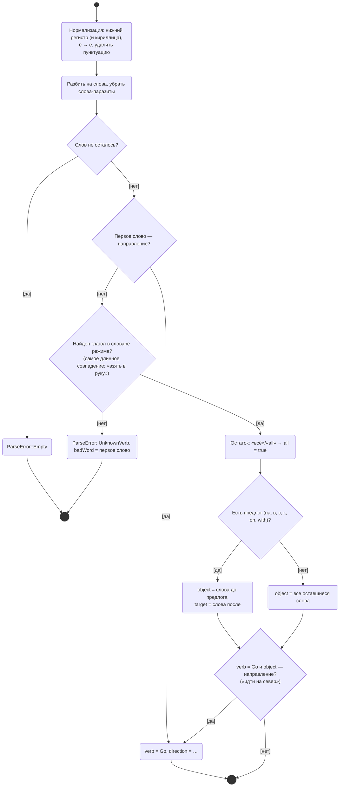
```mermaid
flowchart TD
    s((" ")):::startNode --> n1("Нормализация: нижний регистр (и кириллица),<br/>ё → е, удалить пунктуацию")
    n1 --> n2("Разбить на слова, убрать слова-паразиты")
    n2 --> empty{"Слов не осталось?"}
    empty -- "[да]" --> eEmpty("ParseError::Empty")
    eEmpty --> e1(((" "))):::endNode
    empty -- "[нет]" --> dir{"Первое слово — направление?"}
    dir -- "[да]" --> go("verb = Go, direction = …")
    go --> ok(((" "))):::endNode
    dir -- "[нет]" --> verb{"Найден глагол в словаре режима?<br/>(самое длинное совпадение: «взять в руку»)"}
    verb -- "[нет]" --> eVerb("ParseError::UnknownVerb, badWord = первое слово")
    eVerb --> e1
    verb -- "[да]" --> rest("Остаток: «всё»/«all» → all = true")
    rest --> prep{"Есть предлог (на, в, с, к, on, with)?"}
    prep -- "[да]" --> split("object = слова до предлога,<br/>target = слова после")
    prep -- "[нет]" --> whole("object = все оставшиеся слова")
    split --> gdir{"verb = Go и object — направление?<br/>(«идти на север»)"}
    whole --> gdir
    gdir -- "[да]" --> go
    gdir -- "[нет]" --> ok

    classDef startNode fill:#333,stroke:#333,color:#333
    classDef endNode fill:#333,stroke:#333,color:#333
```

Словарь (`commands.json`) разделён по режимам `exploration` и `combat`. Поэтому в бою `в` означает «вспышка», а при исследовании — «восток».

### 6.3 Поиск объекта по основам слов

У каждого предмета, объекта и врага в данных есть список **основ** (`stems`). Например, у ключа от ворот это `["ключ", "ворот"]`, у ржавого ключа — `["ключ", "ржав"]`. Так парсер понимает падежи без морфологического словаря: «рукоять», «рукоятью» и «рукояти» начинаются с основы «рукоят».

**Алгоритм `EntityResolver::resolve(words, scope, ctx)`:**

1. Собрать кандидатов из области поиска:
   - инвентарь;
   - предметы на полу и объекты комнаты, **если игрок видит**;
   - враги: их можно найти и в темноте, «на слух».
2. Для каждого кандидата вычислить `score` — число слов фразы, которые начинаются с одной из его основ.
3. Отбросить кандидатов со `score = 0`.
4. Если максимальный `score` у одного id, результат `Found`. Если у нескольких **разных** id, результат `Ambiguous`, и игрок получает вопрос «Какой ключ: ржавый ключ или ключ от ворот?». Если кандидатов не осталось, результат `NotFound`: «Здесь нет ничего похожего на „…“».

| Ввод | Кандидаты (score) | Результат |
|---|---|---|
| «взять ключ» | ключ от ворот (1), ржавый ключ (1) | Уточнение |
| «взять ржавый ключ» | ржавый ключ (2), ключ от ворот (1) | ржавый ключ |
| «использовать рукоять на насосе» | object: рукоять насоса (1); target: насос (1) | Found / Found |
| «взять флакон» (на полу два флакона) | oil_flask (1) — один id | Found |

### 6.4 Команды → обработчики → системы

| Команда | Обработчик | Использует | Ход |
|---|---|---|---|
| идти / с, ю, з, в, вв, вн | `GoHandler` | `MovementSystem` | да¹ |
| осмотреться | `LookHandler` | `RoomDescriber` | нет |
| осмотреть X | `ExamineHandler` | `EntityResolver`, `InteractionSystem` (триггер `Examine`) | нет |
| взять X / всё | `TakeHandler` | `EntityResolver`, `Inventory`, `PlayerStats` (улучшения) | да |
| бросить X | `DropHandler` | `EntityResolver`, `Inventory` | да |
| открыть X | `OpenHandler` | `InteractionSystem` (триггер `Open`, контейнеры) | да |
| использовать X [на Y] | `UseHandler` | `InteractionSystem` или эффект расходника | да |
| надеть X | `EquipHandler` | `Equipment`, `PlayerStats` | да |
| читать X | `ReadHandler` | `TextLibrary`, `readNotes` | нет |
| фонарь / потушить фонарь | `LanternHandler` | `LightSystem::setLantern` | нет |
| зажечь / разжечь X | `LightHandler` | `InteractionSystem` (триггер `Light`) | да |
| атаковать X | `AttackHandler` | `CombatSystem::begin` (внезапная атака) | да |
| отдохнуть | `RestHandler` | `LightSystem`, `SaveSystem` | да |
| инвентарь, статус, карта, журнал | `InventoryHandler`, `StatusHandler`, `MapHandler`, `JournalHandler` | `Renderer`, `MapRenderer` | нет |
| сохранить / загрузить | `SaveHandler` / `LoadHandler` | `SaveSystem` | нет |
| помощь, подсказки вкл/выкл, выход | `HelpHandler`, `HintsHandler`, `QuitHandler` | `StringTable`, `HintSystem` | нет |

¹ Если выхода в эту сторону нет, ход не тратится, но в темноте тратится: игрок «натыкается на стену».

Боевые команды (`атака`, `блок`, `вспышка`, `использовать X`, `бежать`, `осмотреть`) разбираются тем же `CommandParser` в режиме `Combat`. `CombatState` превращает их в `CombatAction` и не использует `CommandRegistry`.

### 6.5 Диаграмма последовательности: «использовать рукоять на насосе»

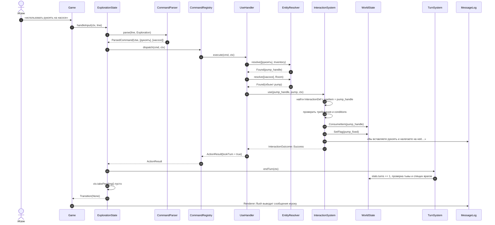
```mermaid
sequenceDiagram
    autonumber
    actor P as Игрок
    participant G as Game
    participant ES as ExplorationState
    participant CP as CommandParser
    participant CR as CommandRegistry
    participant UH as UseHandler
    participant ER as EntityResolver
    participant IS as InteractionSystem
    participant W as WorldState
    participant TS as TurnSystem
    participant LOG as MessageLog

    P->>G: «использовать рукоять на насосе»
    G->>ES: handleInput(ctx, line)
    ES->>CP: parse(line, Exploration)
    CP-->>ES: ParsedCommand{Use, [рукоять], [насосе]}
    ES->>CR: dispatch(cmd, ctx)
    CR->>UH: execute(cmd, ctx)
    UH->>ER: resolve([рукоять], Inventory)
    ER-->>UH: Found(pump_handle)
    UH->>ER: resolve([насосе], Room)
    ER-->>UH: Found(объект pump)
    UH->>IS: use(pump_handle, pump, ctx)
    IS->>IS: найти InteractionDef с useItem = pump_handle
    IS->>IS: проверить требования и conditions
    IS->>W: ConsumeItem(pump_handle)
    IS->>W: SetFlag(pump_fixed)
    IS->>LOG: «Вы вставляете рукоять и налегаете на неё…»
    IS-->>UH: InteractionOutcome::Success
    UH-->>CR: ActionResult{tookTurn = true}
    CR-->>ES: ActionResult
    ES->>TS: endTurn(ctx)
    TS->>W: stats.turns += 1, проверка тьмы и спящих врагов
    ES->>ES: ctx.takePending() пусто
    ES-->>G: Transition(None)
    G->>LOG: Renderer::flush выводит сообщения игроку
```

---

## 7. Игровые системы: реализация механик

### 7.1 Диаграмма классов

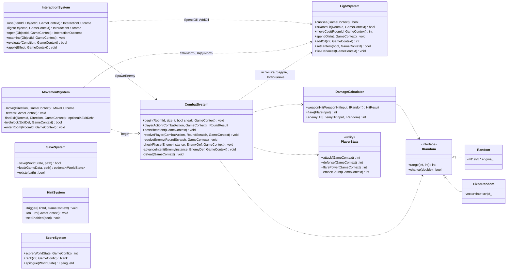
```mermaid
classDiagram
    direction LR
    class LightSystem {
        +canSee(GameContext) bool
        +isRoomLit(RoomId, GameContext) bool
        +moveCost(RoomId, GameContext) int
        +spendOil(int, GameContext) void
        +addOil(int, GameContext) int
        +setLantern(bool, GameContext) bool
        +tickDarkness(GameContext) void
    }
    class MovementSystem {
        +move(Direction, GameContext) MoveOutcome
        +retreat(GameContext) void
        -findExit(RoomId, Direction, GameContext) optional~ExitDef~
        -tryUnlock(ExitDef, GameContext) bool
        -enterRoom(RoomId, GameContext) void
    }
    class InteractionSystem {
        +use(ItemId, ObjectId, GameContext) InteractionOutcome
        +light(ObjectId, GameContext) InteractionOutcome
        +open(ObjectId, GameContext) InteractionOutcome
        +examine(ObjectId, GameContext) void
        +evaluate(Condition, GameContext) bool
        +apply(Effect, GameContext) void
    }
    class CombatSystem {
        +begin(RoomId, size_t, bool sneak, GameContext) void
        +playerAction(CombatAction, GameContext) RoundResult
        +describeIntent(GameContext) void
        -resolvePlayer(CombatAction, RoundScratch, GameContext) void
        -resolveEnemy(RoundScratch, GameContext) void
        -checkPhase(EnemyInstance, EnemyDef, GameContext) void
        -advanceIntent(EnemyInstance, EnemyDef, GameContext) void
        -defeat(GameContext) void
    }
    class DamageCalculator {
        +weaponHit(WeaponHitInput, IRandom) HitResult
        +flare(FlareInput) int
        +enemyHit(EnemyHitInput, IRandom) int
    }
    class PlayerStats {
        <<utility>>
        +attack(GameContext) int
        +defense(GameContext) int
        +flarePower(GameContext) int
        +emberCount(GameContext) int
    }
    class SaveSystem {
        +save(WorldState, path) bool
        +load(GameData, path) optional~WorldState~
        +exists(path) bool
    }
    class HintSystem {
        +trigger(HintId, GameContext) void
        +onTurn(GameContext) void
        +setEnabled(bool) void
    }
    class ScoreSystem {
        +score(WorldState, GameConfig) int
        +rank(int, GameConfig) Rank
        +epilogue(WorldState) EpilogueId
    }
    class IRandom {
        <<interface>>
        +range(int, int) int
        +chance(double) bool
    }
    class Random {
        -mt19937 engine_
    }
    class FixedRandom {
        -vector~int~ script_
    }

    IRandom <|.. Random
    IRandom <|.. FixedRandom
    CombatSystem ..> DamageCalculator
    CombatSystem ..> LightSystem : вспышка, Задуть, Поглощение
    CombatSystem ..> PlayerStats
    CombatSystem ..> IRandom
    MovementSystem ..> LightSystem : стоимость, видимость
    MovementSystem ..> CombatSystem : begin
    InteractionSystem ..> LightSystem : SpendOil, AddOil
    InteractionSystem ..> CombatSystem : SpawnEnemy
    DamageCalculator ..> IRandom
```

Системы **не хранят состояние**: всё, что меняется, лежит в `WorldState`, а константы берутся из `GameConfig`. Поэтому системы можно создавать по значению внутри `Systems` и тестировать по отдельности.

### 7.2 LightSystem — свет, масло и тьма

| Метод | Алгоритм |
|---|---|
| `isRoomLit(room)` | `world.room(room).lit`. Изначально значение берётся из `litByDefault`, после зажжения жаровни становится `true` |
| `canSee()` | `isRoomLit(location) \|\| (lanternLit && oil > 0)` |
| `moveCost(target)` | Освещённая цель — 0. Тёмная цель при горящем фонаре — `config.oilCost.moveDark` (2). При погашенном фонаре — 0 |
| `spendOil(n)` | `oil = max(0, oil − n)`, `stats.oilBurned += n`. Когда запас пересекает 25 и 10, выводится предупреждение. На нуле `lanternLit = false` и сообщение «Фонарь гаснет». Добровольные траты (вспышка, жаровня) заранее проверяют запас; вынужденные («Задуть», «Поглощение») просто списывают, сколько есть |
| `addOil(n)` | `oil = min(maxOil, oil + n)`, возвращает, сколько реально долито (остаток пропадает, об этом выводится сообщение) |
| `setLantern(on)` | Зажечь без масла нельзя. Если фонарь зажжён в комнате со спящими врагами, у них выставляется `wakeIn = 0`: зажигание не тратит ход, и у игрока остаётся ровно один ход до пробуждения |
| `tickDarkness()` | Вызывается из `TurnSystem`. Если игрок видит, счётчик обнуляется. Иначе счётчик увеличивается на 1, выводится сообщение уровня 1–3, а на пороге вызывается `ctx.request(GameOver)` с причиной «тьма» |

### 7.3 MovementSystem — перемещение

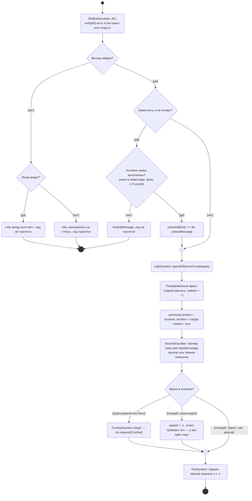
```mermaid
flowchart TD
    s((" ")):::startNode --> f("findExit(location, dir):<br/>exits[dir] есть и (не скрыт или открыт)")
    f --> has{"Выход найден?"}
    has -- "[нет]" --> dark{"Игрок видит?"}
    dark -- "[да]" --> noway("«На запад пути нет», ход не тратится")
    dark -- "[нет]" --> wall("«Вы натыкаетесь на стену», ход тратится")
    noway --> e1(((" "))):::endNode
    wall --> e1
    has -- "[да]" --> lock{"Замок есть и не отперт?"}
    lock -- "[да]" --> cond{"Условия замка выполнены?<br/>(ключ в инвентаре, флаг, ≥ N углей)"}
    cond -- "[нет]" --> locked("lockedMessage, ход не тратится")
    locked --> e1
    cond -- "[да]" --> unlock("unlockedExits += dir, unlockMessage")
    lock -- "[нет]" --> m1{" "}
    unlock --> m1
    m1 --> cost("LightSystem::spendOil(moveCost(target))")
    cost --> calm("Потревоженные враги старой комнаты: wakeIn = −1")
    calm --> go("previousLocation = location, location = target,<br/>visited = true")
    go --> desc("RoomDescriber: баннер зоны при первом входе,<br/>полное или тёмное описание")
    desc --> en{"Враги в комнате?"}
    en -- "[агрессивный или босс]" --> fight("CombatSystem::begin → ctx.request(Combat)")
    en -- "[спящий, игрок видит]" --> dist("wakeIn = 1, «Свет тревожит его — у вас один ход»")
    en -- "[спящий, темно / нет врагов]" --> m2{" "}
    fight --> m2
    dist --> m2
    m2 --> hint("HintSystem: первая тёмная комната и т. п.")
    hint --> e2(((" "))):::endNode

    classDef startNode fill:#333,stroke:#333,color:#333
    classDef endNode fill:#333,stroke:#333,color:#333
```

`wakeIn = 1` при входе, потому что сам переход — это ход, и `endTurn` сразу уменьшит счётчик до 0. Враг проснётся в конце **следующего** хода, если игрок не ударит первым и не уйдёт. `retreat()` — перемещение в `previousLocation` при бегстве из боя: замки не проверяются, масло тратится как обычно.

**Диаграмма последовательности: вход в комнату с агрессивным врагом**

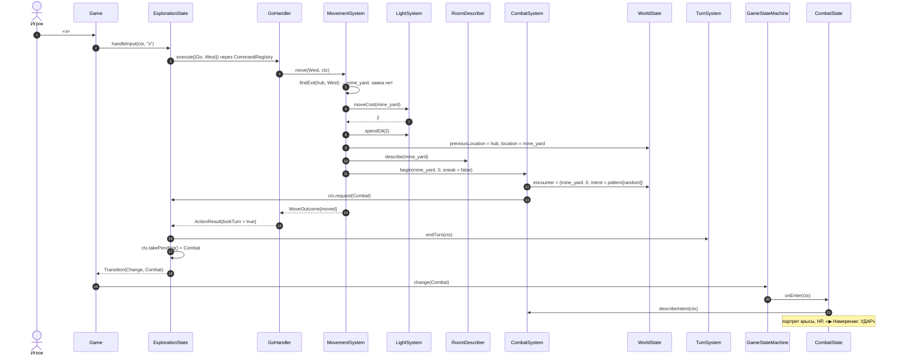
```mermaid
sequenceDiagram
    autonumber
    actor P as Игрок
    participant G as Game
    participant ES as ExplorationState
    participant GH as GoHandler
    participant MS as MovementSystem
    participant LS as LightSystem
    participant RD as RoomDescriber
    participant CS as CombatSystem
    participant W as WorldState
    participant TS as TurnSystem
    participant F as GameStateMachine
    participant CSt as CombatState

    P->>G: «з»
    G->>ES: handleInput(ctx, "з")
    ES->>GH: execute({Go, West}) через CommandRegistry
    GH->>MS: move(West, ctx)
    MS->>MS: findExit(hub, West) → mine_yard, замка нет
    MS->>LS: moveCost(mine_yard)
    LS-->>MS: 2
    MS->>LS: spendOil(2)
    MS->>W: previousLocation = hub, location = mine_yard
    MS->>RD: describe(mine_yard)
    MS->>CS: begin(mine_yard, 0, sneak = false)
    CS->>W: encounter = {mine_yard, 0, intent = pattern[random]}
    CS->>ES: ctx.request(Combat)
    MS-->>GH: MoveOutcome{moved}
    GH-->>ES: ActionResult{tookTurn = true}
    ES->>TS: endTurn(ctx)
    ES->>ES: ctx.takePending() = Combat
    ES-->>G: Transition(Change, Combat)
    G->>F: change(Combat)
    F->>CSt: onEnter(ctx)
    CSt->>CS: describeIntent(ctx)
    Note over CSt: портрет крысы, HP, «▶ Намерение: УДАР»
```

### 7.4 InteractionSystem — загадки и объекты

**Алгоритм `use / light / open / examine(object)`:**

1. Найти в `ObjectDef.interactions` первое взаимодействие с подходящим триггером (для `Use` — ещё и с `useItem`), которое не выполнено как одноразовое.
   - Не нашлось → `open` у контейнера показывает содержимое и выставляет `opened = true`; иначе «Ничего не происходит», ход не тратится.
2. Проверить автоматические требования: фонарь для `Light`, масло для всех `SpendOil`, `usesLeft ≠ 0`.
   - Не выполнены → отказ, ход не тратится.
3. Все `conditions` истинны → применить `effects`, вывести `message`, отметить одноразовое взаимодействие, уменьшить `usesLeft`.
4. Хотя бы одно условие ложно → применить `onFail`, вывести `failMessage`.
5. Ход тратится (кроме `examine`).

```cpp
void InteractionSystem::apply(const Effect& effect, GameContext& ctx) {
    std::visit(overloaded{
        [&](const SetFlag& e)     { ctx.world.flags.insert(e.flag); },
        [&](const ClearFlags& e)  { for (auto& f : e.flags) ctx.world.flags.erase(f); },
        [&](const GiveItem& e)    { ctx.world.player.inventory.add(e.item, e.count); },
        [&](const ConsumeItem& e) { ctx.world.player.inventory.remove(e.item, e.count); },
        [&](const RevealExit& e)  { ctx.world.room(e.room).revealedExits.insert(e.dir); },
        [&](const UnlockExit& e)  { ctx.world.room(e.room).unlockedExits.insert(e.dir); },
        [&](const SpawnEnemy& e)  { ctx.sys.combat.spawnAndBegin(e.enemy, ctx); },
        [&](const SpendOil& e)    { ctx.sys.light.spendOil(e.amount, ctx); },
        [&](const AddOil& e)      { ctx.sys.light.addOil(e.amount, ctx); },
        [&](const LightRoom&)     { ctx.world.currentRoom().lit = true; },
        [&](const ShowText& e)    { ctx.log.push(MsgType::Narrative, e.text); },
        [&](const WinGame&)       { ctx.request(StateId::Victory); },
    }, effect);
}
```

| Загадка (GDD, раздел 3.7) | Объект | Триггер | Условия | Эффекты |
|---|---|---|---|---|
| Жаровня (×6) | `brazier` | `Light` | `NotFlag <room>_lit` | `SpendOil 10`, `LightRoom`, `SetFlag <room>_lit` |
| Ящик стола | `desk` (Container) | `Open` | — | показать содержимое (ключ от ворот) |
| Лаз за шкафом | `cabinet` | `Examine` | — | `RevealExit {mine_bunkhouse, east}` |
| Насос | `pump` | `Use pump_handle` | — | `ConsumeItem`, `SetFlag pump_fixed` (замок выхода вниз проверяет этот флаг) |
| Котёл и топка | `boiler`, `furnace` | `Use valve`, затем `Light` | для топки `HasFlag valve_installed` | `SetFlag valve_installed`, затем `SpendOil 10`, `SetFlag lift_powered` |
| Аварийная цистерна | `cistern` (uses = 2) | `Use` | — | `AddOil 40` |
| Три чаши | `bowl_memory`, `bowl_faith`, `bowl_hope` | `Light` | цепочка флагов ([3.3](#33-условия-и-эффекты-взаимодействий)) | флаги, `UnlockExit`; при ошибке — сброс и `SpawnEnemy wailer` |
| Чаша Сердца | `heart` | `Light` («разжечь сердце») | `HasFlag lighteater_defeated`, `EmberCount 3` | `ConsumeItem` углей, `WinGame` |

### 7.5 CombatSystem — бой

**Начало боя.** `begin(room, index, sneak)`:

- создаёт `Encounter` и печатает портрет (`art`), имя и HP врага;
- выбирает стартовое намерение: у обычных врагов `patternIndex = rng.range(0, n−1)`, у боссов 0, чтобы первый ход босса был заранее известен;
- при `sneak = true` (атака по спящему) сначала наносит удар оружием ×2, врагу при этом ответить нечем;
- в конце запрашивает `ctx.request(Combat)`.

**Раунд боя — диаграмма деятельности**

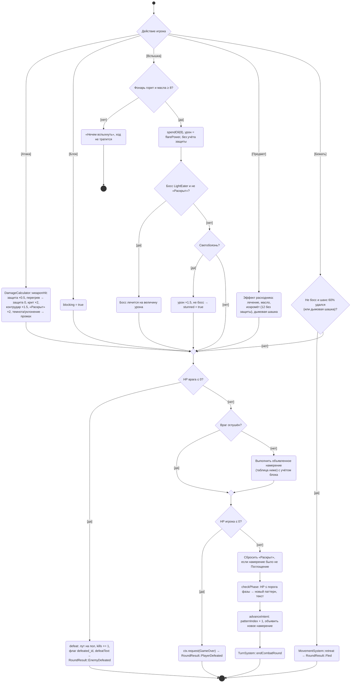
```mermaid
flowchart TD
    s((" ")):::startNode --> act{"Действие игрока"}
    act -- "[Атака]" --> atk("DamageCalculator::weaponHit:<br/>защита ×0.5, перегрев → защита 0, крит ×2,<br/>контрудар ×1.5, «Раскрыт» ×2, темнота/уклонение → промах")
    act -- "[Блок]" --> blk("blocking = true")
    act -- "[Вспышка]" --> can{"Фонарь горит и масла ≥ 8?"}
    can -- "[нет]" --> refuse("«Нечем вспыхнуть», ход не тратится")
    refuse --> e0(((" "))):::endNode
    can -- "[да]" --> fl("spendOil(8), урон = flarePower, без учёта защиты")
    fl --> le{"Босс LightEater и не «Раскрыт»?"}
    le -- "[да]" --> heal("Босс лечится на величину урона")
    le -- "[нет]" --> ph{"Светобоязнь?"}
    ph -- "[да]" --> phx("урон ×1.5, не босс → stunned = true")
    ph -- "[нет]" --> m1
    phx --> m1{" "}
    heal --> m1
    act -- "[Предмет]" --> item("Эффект расходника: лечение, масло,<br/>искромёт (12 без защиты), дымовая шашка")
    act -- "[Бежать]" --> flee{"Не босс и шанс 60% удался<br/>(или дымовая шашка)?"}
    flee -- "[да]" --> fled("MovementSystem::retreat → RoundResult::Fled")
    fled --> e1(((" "))):::endNode
    flee -- "[нет]" --> m1
    atk --> m1
    blk --> m1
    item --> m1
    m1 --> dead{"HP врага ≤ 0?"}
    dead -- "[да]" --> win("defeat: лут на пол, kills += 1,<br/>флаг defeated_id, defeatText → RoundResult::EnemyDefeated")
    win --> e1
    dead -- "[нет]" --> st{"Враг оглушён?"}
    st -- "[да]" --> m2{" "}
    st -- "[нет]" --> intent("Выполнить объявленное намерение<br/>(таблица ниже) с учётом блока")
    intent --> m2
    m2 --> pdead{"HP игрока ≤ 0?"}
    pdead -- "[да]" --> lose("ctx.request(GameOver) → RoundResult::PlayerDefeated")
    lose --> e1
    pdead -- "[нет]" --> clr("Сбросить «Раскрыт», если намерение было не Поглощение")
    clr --> phase("checkPhase: HP ≤ порога фазы → новый паттерн, текст")
    phase --> next("advanceIntent: patternIndex + 1, объявить новое намерение")
    next --> tick("TurnSystem::endCombatRound")
    tick --> e1

    classDef startNode fill:#333,stroke:#333,color:#333
    classDef endNode fill:#333,stroke:#333,color:#333
```

**Выполнение намерений врага** (шаг «Выполнить объявленное намерение»):

| Намерение | Без блока | С блоком |
|---|---|---|
| `Attack` | `enemyHit(atk, defense)` | ×0.25, с округлением вниз |
| `Heavy` | `enemyHit × 2` | 0, `encounter.counterReady = true` |
| `Guard` | Действует на шаге атаки игрока (урон ×0.5) | — |
| `Snuff` | `spendOil(snuffAmount)` (10, у боссов 15) | Без эффекта |
| `Overheat` | Бездействие, защита 0 учитывается на шаге атаки игрока | — |
| `Drain` | Забирает `min(20, oil)`, босс лечится на половину, `exposed = true` | Забирает `min(5, oil)`, остальное так же |

`Guard` и `Overheat` влияют на действие игрока в **том же** раунде. Это правильно, потому что намерение объявлено до хода игрока.

**Формулы** — перенос раздела 8.1 GDD в код:

```cpp
HitResult DamageCalculator::weaponHit(const WeaponHitInput& in, IRandom& rng) const {
    if (in.inDarkness && rng.chance(cfg_.darkMissChance)) return HitResult::miss(Miss::Darkness);
    if (rng.chance(in.dodgeChance))                        return HitResult::miss(Miss::Dodge);
    const int raw = in.attack + rng.range(0, 2);
    double dmg = std::max(1, raw - (in.targetOverheated ? 0 : in.targetDef));
    if (in.targetGuarding) dmg = std::ceil(dmg * cfg_.guardMult);   // ×0.5
    const bool crit = rng.chance(cfg_.critChance);                  // 10%
    if (crit)             dmg *= cfg_.critMult;                     // ×2
    if (in.counter)       dmg *= cfg_.counterMult;                  // ×1.5
    if (in.doubleDamage)  dmg *= 2;                                 // «Раскрыт» или внезапная атака
    return HitResult::hit(static_cast<int>(dmg), crit);
}
```

**Фазы босса.** После каждого урона `checkPhase` сравнивает `hp / def.hp` с `phases[phase].hpBelow`. Если порог пройден, увеличивается `phase`, паттерн заменяется на `phases[phase].pattern`, `patternIndex` сбрасывается в 0, выводится `message` («Тьма в зале сгущается»). У Глотателя Света одна дополнительная фаза на 50%.

**Победа над врагом.** Враг удаляется из `RoomState::enemies`, его лут ложится на пол (игрок подбирает его командой `взять всё`), ставится флаг `defeated_<enemyId>` и выводится `defeatText` — например, последние слова Погасшего Орина. Бой завершается: `encounter.reset()`, `ctx.request(Exploration)`.

**Диаграмма последовательности: блок против сильного удара**

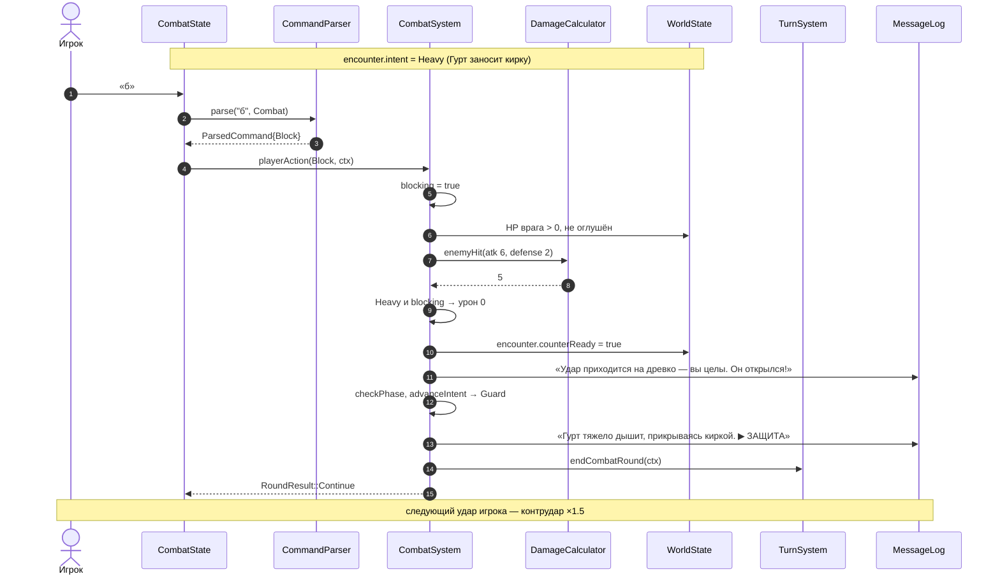
```mermaid
sequenceDiagram
    autonumber
    actor P as Игрок
    participant CSt as CombatState
    participant CP as CommandParser
    participant CS as CombatSystem
    participant DC as DamageCalculator
    participant W as WorldState
    participant TS as TurnSystem
    participant LOG as MessageLog

    Note over CSt,W: encounter.intent = Heavy (Гурт заносит кирку)
    P->>CSt: «б»
    CSt->>CP: parse("б", Combat)
    CP-->>CSt: ParsedCommand{Block}
    CSt->>CS: playerAction(Block, ctx)
    CS->>CS: blocking = true
    CS->>W: HP врага > 0, не оглушён
    CS->>DC: enemyHit(atk 6, defense 2)
    DC-->>CS: 5
    CS->>CS: Heavy и blocking → урон 0
    CS->>W: encounter.counterReady = true
    CS->>LOG: «Удар приходится на древко — вы целы. Он открылся!»
    CS->>CS: checkPhase, advanceIntent → Guard
    CS->>LOG: «Гурт тяжело дышит, прикрываясь киркой. ▶ ЗАЩИТА»
    CS->>TS: endCombatRound(ctx)
    CS-->>CSt: RoundResult::Continue
    Note over P,LOG: следующий удар игрока — контрудар ×1.5
```

### 7.6 Жизненный цикл врага

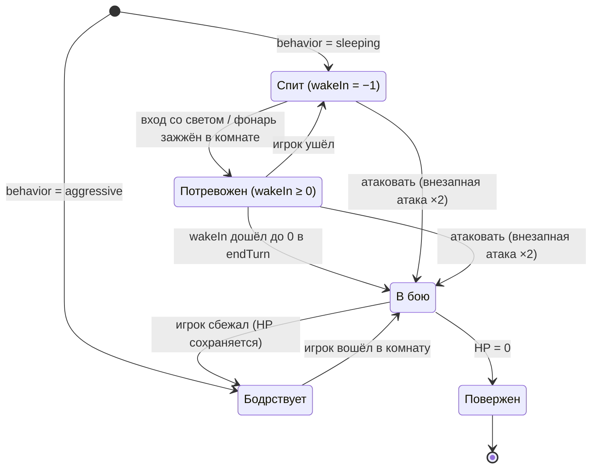
```mermaid
stateDiagram-v2
    state "Спит (wakeIn = −1)" as Asleep
    state "Потревожен (wakeIn ≥ 0)" as Disturbed
    state "Бодрствует" as Awake
    state "В бою" as Fighting
    state "Повержен" as Defeated

    [*] --> Asleep : behavior = sleeping
    [*] --> Awake : behavior = aggressive
    Asleep --> Disturbed : вход со светом / фонарь зажжён в комнате
    Disturbed --> Asleep : игрок ушёл
    Disturbed --> Fighting : wakeIn дошёл до 0 в endTurn
    Asleep --> Fighting : атаковать (внезапная атака ×2)
    Disturbed --> Fighting : атаковать (внезапная атака ×2)
    Awake --> Fighting : игрок вошёл в комнату
    Fighting --> Awake : игрок сбежал (HP сохраняется)
    Fighting --> Defeated : HP = 0
    Defeated --> [*]
```

### 7.7 SaveSystem — сохранение у жаровни

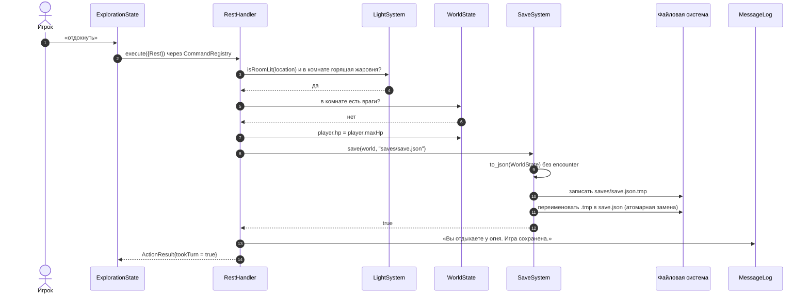
```mermaid
sequenceDiagram
    autonumber
    actor P as Игрок
    participant ES as ExplorationState
    participant RH as RestHandler
    participant LS as LightSystem
    participant W as WorldState
    participant SS as SaveSystem
    participant FS as Файловая система
    participant LOG as MessageLog

    P->>ES: «отдохнуть»
    ES->>RH: execute({Rest}) через CommandRegistry
    RH->>LS: isRoomLit(location) и в комнате горящая жаровня?
    LS-->>RH: да
    RH->>W: в комнате есть враги?
    W-->>RH: нет
    RH->>W: player.hp = player.maxHp
    RH->>SS: save(world, "saves/save.json")
    SS->>SS: to_json(WorldState) без encounter
    SS->>FS: записать saves/save.json.tmp
    SS->>FS: переименовать .tmp в save.json (атомарная замена)
    SS-->>RH: true
    RH->>LOG: «Вы отдыхаете у огня. Игра сохранена.»
    RH-->>ES: ActionResult{tookTurn = true}
```

Запись через временный файл и переименование защищает прежнее сохранение, если игра упадёт посреди записи.

### 7.8 HintSystem, ScoreSystem, финал

- **HintSystem** показывает каждую подсказку из `strings.json` (раздел `hints`) один раз и запоминает её в `shownHints`. Подсказки срабатывают по событиям: первая тёмная комната, первый бой, первое «Задуть», масло ≤ 25, первая жаровня. Команда `подсказки выкл` отключает их.
- **ScoreSystem** считает очки по формуле из GDD (раздел 8.1), определяет рейтинг по порогам `config.score` и выбирает эпилог: Б, если в `readNotes` все 8 записок, иначе А.
- **VictoryState::onEnter** выводит `art/endings/victory.txt`, текст эпилога, статистику и рейтинг, затем удаляет `saves/save.json`, чтобы «Продолжить» не возвращало в пройденную игру.

---

## 8. Интерфейс: консоль и вывод

### 8.1 Диаграмма классов

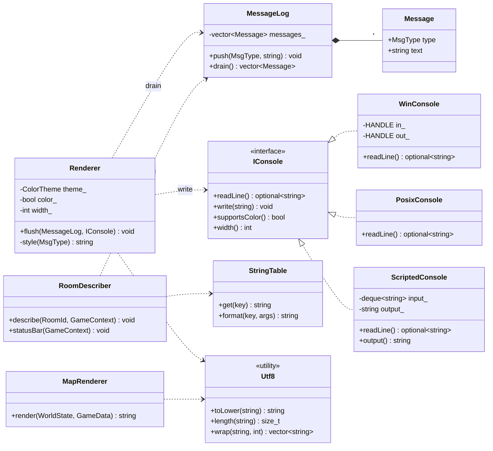
```mermaid
classDiagram
    direction LR
    class IConsole {
        <<interface>>
        +readLine() optional~string~
        +write(string) void
        +supportsColor() bool
        +width() int
    }
    class WinConsole {
        -HANDLE in_
        -HANDLE out_
        +readLine() optional~string~
    }
    class PosixConsole {
        +readLine() optional~string~
    }
    class ScriptedConsole {
        -deque~string~ input_
        -string output_
        +readLine() optional~string~
        +output() string
    }
    class MessageLog {
        -vector~Message~ messages_
        +push(MsgType, string) void
        +drain() vector~Message~
    }
    class Message {
        +MsgType type
        +string text
    }
    class Renderer {
        -ColorTheme theme_
        -bool color_
        -int width_
        +flush(MessageLog, IConsole) void
        -style(MsgType) string
    }
    class RoomDescriber {
        +describe(RoomId, GameContext) void
        +statusBar(GameContext) void
    }
    class MapRenderer {
        +render(WorldState, GameData) string
    }
    class StringTable {
        +get(key) string
        +format(key, args) string
    }
    class Utf8 {
        <<utility>>
        +toLower(string) string
        +length(string) size_t
        +wrap(string, int) vector~string~
    }

    IConsole <|.. WinConsole
    IConsole <|.. PosixConsole
    IConsole <|.. ScriptedConsole
    MessageLog *-- "*" Message
    Renderer ..> MessageLog : drain
    Renderer ..> IConsole : write
    Renderer ..> Utf8 : wrap
    RoomDescriber ..> MessageLog : push
    RoomDescriber ..> StringTable
    MapRenderer ..> Utf8
```

### 8.2 Конвейер вывода

1. Игровая логика вызывает `log.push(MsgType::Damage, strings.format("combat.hit", {{"dmg", "4"}}))`. Тексты берутся из `StringTable` с подстановкой `{dmg}`, `{item}`, `{enemy}`.
2. `Renderer::flush` забирает все сообщения и для каждого:
   - выбирает цвет по типу (`Narrative` — светло-серый, `DarkNarrative` — тёмно-серый, `Damage`/`Intent` — красный, `Item` — голубой, `Heal` — зелёный, `Lore` — пурпурный, `Title`/`Oil` — янтарный);
   - переносит строки по ширине 80 символов **по кодовым точкам UTF-8**, а не по байтам;
   - пишет результат в `IConsole`.
3. Если цвета выключены (`--no-color` или терминал без поддержки ANSI), ANSI-коды не выводятся.

### 8.3 Кроссплатформенная консоль

| | Windows (`WinConsole`) | Linux/macOS (`PosixConsole`) |
|---|---|---|
| Вывод | `SetConsoleOutputCP(CP_UTF8)`; ANSI включается через `SetConsoleMode(… ENABLE_VIRTUAL_TERMINAL_PROCESSING)` | UTF-8 по умолчанию, ANSI поддерживается |
| Ввод | `ReadConsoleW` → `WideCharToMultiByte(CP_UTF8)`: так кириллица читается корректно | `std::getline(std::cin)` |
| Цвет | Есть, если удалось включить VT-режим | Есть, если `isatty(stdout)` |
| Ввод перенаправлен из файла | `GetConsoleMode` возвращает ошибку → используется `std::getline` | `std::getline` |

`ScriptedConsole` берёт ввод из списка строк и накапливает вывод. Она используется в тестах и в режиме `--script`.

### 8.4 ASCII-карта

1. Собрать посещённые комнаты и их известные выходы. Соседние непосещённые комнаты отмечаются `?`.
2. По полю `map {x, y}` найти границы и построить сетку: ячейка — 14 символов в ширину и 2 строки в высоту.
3. В ячейки вписать `mapLabel` (до 12 символов) с отметками: `@` — игрок, `#` — горящая жаровня, `!` — живой враг, замеченный игроком.
4. Между соседями по горизонтали нарисовать `──`, по вертикали `│`; для переходов вверх/вниз — `┆`, для скрытых проходов — `┄`.
5. Добавить легенду и вывести результат через `MessageLog` (тип `Map`).

Координаты в `rooms.json` расставляет дизайнер уровня так, чтобы комнаты разных этажей не перекрывались (схема — в GDD, раздел 6.1). `DataValidator` проверяет, что у двух комнат не совпадают координаты.

---

## 9. Ошибки, тестирование, отладка

### 9.1 Обработка ошибок

| Ситуация | Реакция |
|---|---|
| Файл данных не найден или JSON повреждён | `DataError` с именем файла и позицией. `main` выводит ошибку и завершается с кодом 1 |
| Битая ссылка (`to`, `loot`, `use_item`, `art`), неизвестный ключ эффекта, одинаковые координаты на карте | `DataValidator` собирает **все** ошибки сразу и выводит их списком, игра не запускается |
| Повреждённое сохранение | «Сохранение повреждено», текущая игра продолжается |
| Непредвиденное состояние во время игры | `assert` в отладочной сборке; в релизе — нейтральное сообщение, ход не тратится. Исключения внутри игрового цикла не используются |

### 9.2 Тесты (doctest)

| Модуль | Что проверяется |
|---|---|
| `Utf8`, `TextNormalizer` | Нижний регистр кириллицы, `ё → е`, перенос строк по кодовым точкам |
| `CommandParser` | Глаголы и синонимы, направления, предлоги, «взять всё», многословные глаголы, ошибки |
| `EntityResolver` | Поиск по основам, неоднозначность, невидимые в темноте предметы |
| `DamageCalculator` | Все множители формул с `FixedRandom` |
| `LightSystem` | Стоимость переходов, автоматическое погасание, счётчик тьмы и смерть на пороге |
| `InteractionSystem` | Насос; чаши (правильный порядок, ошибка со сбросом и появлением врага); цистерна (2 использования) |
| `CombatSystem` | Блок сильного удара → контрудар; «Задуть» при блоке; фаза босса на 50%; Поглощение → «Раскрыт» → урон ×2; вспышка лечит Глотателя |
| `SaveSystem` | save → load → состояние совпадает с исходным |
| `DataValidator` | Намеренно сломанные данные дают ожидаемые ошибки |
| **Сценарий прохождения** | `ScriptedConsole` + `tests/walkthrough.txt` + фиксированный seed → игра доходит до `Victory`. Это автоматическая проверка, что прохождение не заходит в тупик |

### 9.3 Параметры командной строки

```
lamplighter [--data DIR] [--seed N] [--no-color] [--width N] [--script FILE]
```

- `--seed` фиксирует генератор случайных чисел: баг воспроизводится, бой повторяется.
- `--script` выполняет команды из файла, затем передаёт управление игроку. Удобно для тестов и для записи 30-секундного видео в M3: нужная сцена воспроизводится одинаково с первого дубля.

---

## 10. Трассировка: механики GDD → классы

| Механика (раздел GDD) | Где реализована |
|---|---|
| Перемещение, запертые и скрытые выходы (3.4) | `MovementSystem`, `LockDef`, `RoomState::revealedExits/unlockedExits` |
| Масло, фонарь, тёмные и освещённые комнаты (3.3) | `LightSystem`, `PlayerState::oil/lanternLit`, `RoomState::lit` |
| Счётчик тьмы и смерть (3.3, 3.9) | `LightSystem::tickDarkness` из `TurnSystem::endTurn` |
| Жаровни, отдых, сохранение (3.3, 3.10) | Объект `Brazier` + `InteractionSystem`, `RestHandler`, `SaveSystem` |
| Двойные описания комнат (1.4) | `RoomDef::description/descriptionDark`, `RoomDescriber` |
| Предметы, инвентарь, экипировка (3.5) | `Inventory`, `Equipment`, `TakeHandler`, `EquipHandler`, `PlayerStats` |
| Бой, намерения, блок, вспышка, бегство (3.6) | `CombatSystem`, `DamageCalculator`, `Encounter`, `EnemyInstance` |
| Боссы и фазы (7.3) | `EnemyDef::phases/traits`, `CombatSystem::checkPhase`, намерение `Drain`, черта `LightEater` |
| Спящие враги и скрытность (3.6) | `EnemyInstance::wakeIn`, `MovementSystem`, `TurnSystem`, `LightSystem::setLantern` |
| Загадки (3.7) | Данные `InteractionDef` + `InteractionSystem` |
| Парсер на русском (4.3) | `TextNormalizer`, `Lexicon`, `CommandParser`, `EntityResolver` |
| Контекстные подсказки (4.4) | `HintSystem`, `WorldState::shownHints` |
| ASCII-карта (3.4, 5.3) | `MapRenderer`, `RoomDef::map/mapLabel` |
| Записки, журнал, эпилоги, рейтинг (7.5, 3.9) | `ReadHandler`, `JournalHandler`, `ScoreSystem`, `VictoryState` |
| Внешние ассеты (10.2) | `DataLoader`, `DataValidator`, `TextLibrary`, `StringTable` |
| Кодировка и цвета (5.2, 10.5) | `WinConsole`/`PosixConsole`, `Renderer`, `Utf8` |

---

## 11. План реализации (Milestone 3)

Порядок выбран так, чтобы после каждого шага игра запускалась и её можно было попробовать.

| Шаг | Результат | Классы |
|---|---|---|
| 1. Каркас | Окно консоли, эхо введённых строк, кириллица на Windows | `IConsole`, `WinConsole`, `PosixConsole`, `MessageLog`, `Renderer`, `Utf8`, `Game`, CMake |
| 2. Данные | Загрузка и проверка 4 комнат пролога | `*Def`, `GameData`, `DataLoader`, `DataValidator`, `WorldFactory` |
| 3. Исследование | Ходить, осматривать, брать, открывать | `CommandParser`, `EntityResolver`, `CommandRegistry`, базовые обработчики, `MovementSystem`, `RoomDescriber` |
| 4. Свет | Масло, тьма, жаровни | `LightSystem`, `TurnSystem`, `InteractionSystem` (Light) |
| 5. Взаимодействия | Все загадки из данных | `InteractionSystem` полностью |
| 6. Бой | Враги, намерения, боссы | `DamageCalculator`, `CombatSystem`, `CombatState` |
| 7. Обвязка | Сохранение, карта, подсказки, финал | `SaveSystem`, `MapRenderer`, `HintSystem`, `ScoreSystem`, `GameOverState`, `VictoryState` |
| 8. Контент и полировка | 28 комнат, баланс, ASCII-арт, сценарий прохождения, видео | Данные, `tests/walkthrough.txt` |
