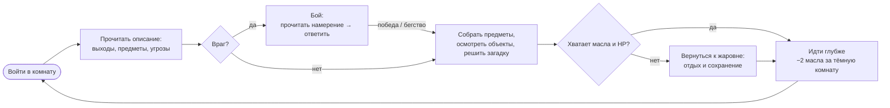
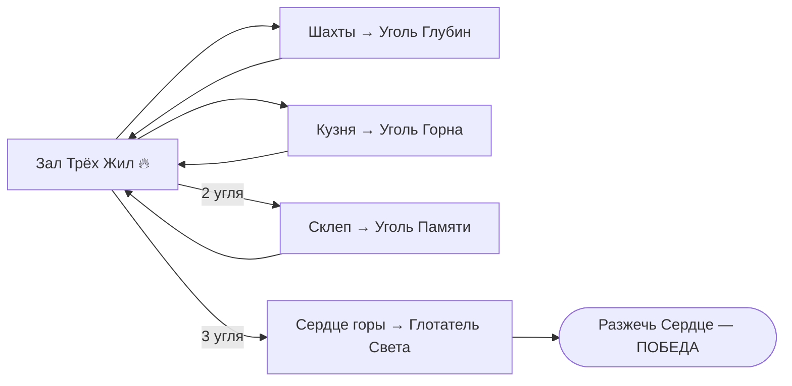
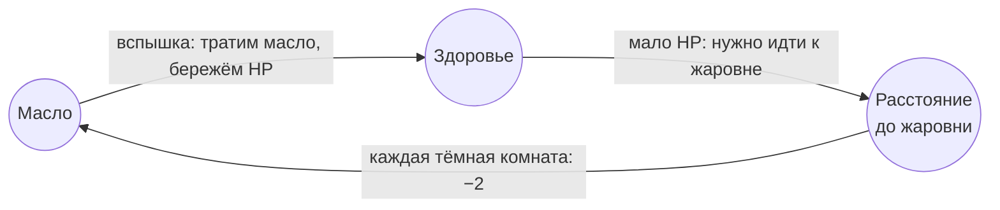
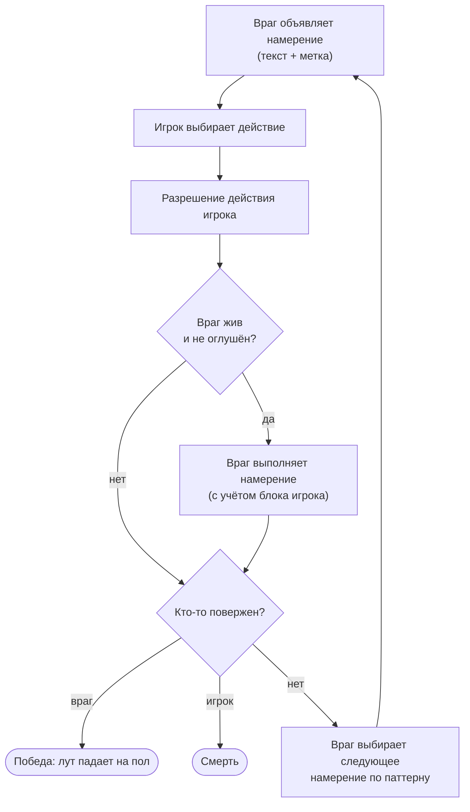
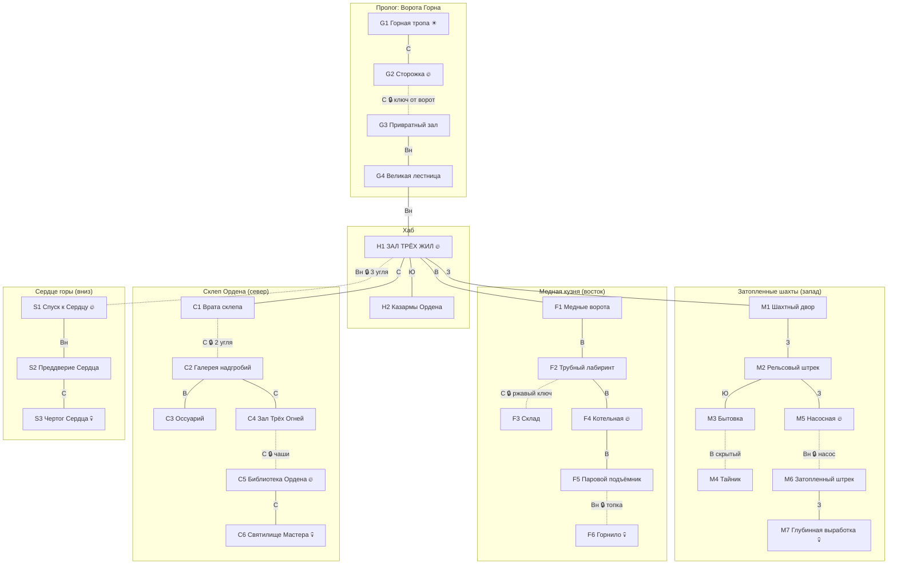
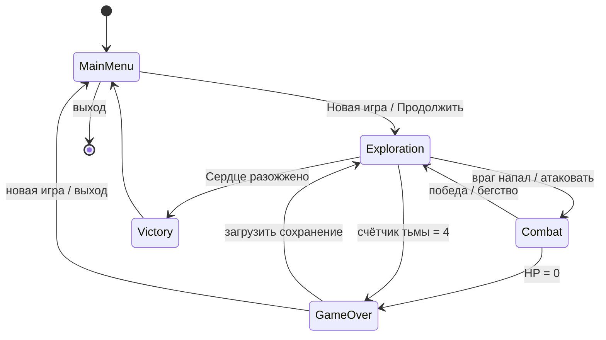

# Последний фонарщик — Game Design Document

> Текстовый dungeon crawler на C++ в духе Zork, где свет фонаря — это одновременно время, защита и оружие.

| | |
|---|---|
| **Рабочее название** | «Последний фонарщик» (англ. *The Last Lamplighter*) |
| **Жанр** | Текстовая RPG / dungeon crawler / interactive fiction |
| **Платформа** | Консоль: Windows 10+, Linux, macOS (терминал с UTF-8) |
| **Реализация** | C++17, CMake; весь контент — во внешних файлах |
| **Язык игры** | Русский (у команд есть английские синонимы) |
| **Длительность** | 50–70 минут на первое прохождение |
| **Версия документа** | 1.0 — Milestone 1 |
| **Дата** | 23.09.2026 |
| **Авторы** | Бабкин Д.А. (504727), Стефановский Е.А. (467600) |

Краткая версия документа по шаблону 1-pager: [GDD-1-pager.md](GDD-1-pager.md).

## Содержание

1. [Обзор](#1-обзор)
2. [Мир и сюжет](#2-мир-и-сюжет)
3. [Игровой процесс](#3-игровой-процесс)
4. [Управление и парсер команд](#4-управление-и-парсер-команд)
5. [Интерфейс и визуальный стиль](#5-интерфейс-и-визуальный-стиль)
6. [Мир: level design](#6-мир-level-design)
7. [Контент: персонаж, враги, предметы](#7-контент-персонаж-враги-предметы)
8. [Баланс](#8-баланс)
9. [Пример игровой сессии](#9-пример-игровой-сессии)
10. [Техническая часть и ассеты](#10-техническая-часть-и-ассеты)
11. [Объём работ, план и риски](#11-объём-работ-план-и-риски)
12. [Глоссарий](#12-глоссарий)

---

## 1. Обзор

### 1.1 Концепция

**Логлайн.** Спуститесь в недра горы с фонарём, в котором заканчивается масло, и разожгите погасшее Сердце Пламени, пока тьма не поглотила город — и вас.

**Коротко об игре.** «Последний фонарщик» — текстовая RPG с парсером команд, как в Zork. Главный ресурс игры — масло в фонаре, и свет в ней выполняет три роли:

- **Время.** Каждый переход в тёмную комнату сжигает масло. Настоящего таймера нет, но запас масла постоянно убывает.
- **Знание.** Без света игрок не видит ни предметов, ни выходов: описание комнаты сводится к звукам, запахам и тому, что можно нащупать.
- **Оружие.** Вспышка фонаря обжигает существ тьмы, но стоит дорого.

Бои пошаговые, и враг заранее объявляет своё намерение: *«Бригадир медленно заносит кирку над головой…»*. Игрок отвечает атакой, блоком, вспышкой или предметом. Мир состоит из 28 комнат в четырёх зонах. Чтобы победить, нужно добыть три Угля Сердца, одолеть Глотателя Света и снова разжечь Сердце горы.

**Формула:** *Zork × Darkest Dungeon × Slay the Spire*.

### 1.2 Референсы

| Игра | Что берём |
|---|---|
| **Zork** (1980) | Парсер команд, повествование во втором лице, смерть в темноте («It is pitch black. You are likely to be eaten by a grue») |
| **Darkest Dungeon** | Свет как ресурс, от которого зависит опасность |
| **Slay the Spire** | Враги заранее показывают, что сделают; бой похож на головоломку |
| **Dark Souls** | Костры (у нас жаровни) как единственные безопасные точки для отдыха и сохранения |
| **A Dark Room** | Минимализм: атмосферу создаёт короткий точный текст |

### 1.3 Столпы (key pillars)

Каждое дизайнерское решение сверяется с этими четырьмя пунктами:

1. **Свет — это жизнь.** Каждое решение так или иначе стоит масла. Игрок всё время чувствует, что ресурс убывает, но в реальном времени его никто не торопит.
2. **Читай тьму.** Текст и есть геймплей. Подсказки к загадкам, намерения врагов и тайники спрятаны в описаниях, и внимательное чтение окупается.
3. **Маленький мир, глубокие решения.** Систем немного, но они связаны между собой: масло, здоровье и расстояние до жаровни влияют друг на друга. Гринда нет.
4. **Тепло у огня.** Тёмные коридоры держат в напряжении, у зажжённой жаровни наступает облегчение. Игра построена на этом контрасте.

**Какие эмоции мы хотим вызвать:** напряжение → любопытство → облегчение → триумф.

### 1.4 Уникальные особенности

| # | Особенность | Зачем она нужна |
|---|---|---|
| 1 | **Триада света**: масло тратится на перемещение, защиту и оружие | Одно число связывает исследование, бой и выживание |
| 2 | **Двойные описания комнат**: при свете видны детали, в темноте остаются только звуки и запахи | Свет буквально открывает текст |
| 3 | **Намерения врагов** объявляются текстом до хода игрока | Бой требует прочитать ситуацию, а не бить наугад |
| 4 | **Жаровни** навсегда освещают комнату | Игрок сам строит себе безопасный маршрут |
| 5 | **Скрытность без света**: спящие враги не просыпаются, если войти в темноте | У выключенного фонаря есть смысл, а не только риск |
| 6 | **Русский парсер** с синонимами, падежами и сокращениями | Естественный ввод: «использовать рукоять на насосе» |
| 7 | **ASCII-карта** исследованных комнат и ASCII-портреты врагов | Помогает ориентироваться и задаёт стиль |
| 8 | **Data-driven**: мир, враги, предметы, тексты и арт лежат во внешних файлах | Новый мир собирается без перекомпиляции |

### 1.5 Соответствие требованиям задания

| Требование | Как выполняется |
|---|---|
| Мир, по которому перемещается персонаж | 28 комнат в 4 зонах, 6 направлений (С/Ю/З/В/вверх/вниз), запертые и скрытые проходы, ASCII-карта ([раздел 6](#6-мир-level-design)) |
| Предметы, которые можно собирать и использовать | 32 вида предметов в 6 категориях: оружие, броня, расходники, улучшения, ключевые предметы, записки. Есть команды «взять», «использовать X на Y», «надеть» ([7.4](#74-предметы)) |
| Враги и механика боя | 6 типов обычных врагов и 4 босса; пошаговый бой с объявленными намерениями, блоком, вспышкой и бегством ([3.6](#36-бой)) |
| Игру можно выиграть | Победить Глотателя Света и разжечь Сердце тремя углями, после чего идёт эпилог в одном из двух вариантов ([3.9](#39-победа-и-поражение)) |
| Консольный интерфейс | Текстовый интерфейс с ASCII-артом и ANSI-цветами ([раздел 5](#5-интерфейс-и-визуальный-стиль)) |
| Все ассеты во внешних файлах | JSON: комнаты, предметы, враги, баланс, словарь парсера, строки UI. TXT: ASCII-арт, записки ([раздел 10](#10-техническая-часть-и-ассеты)) |
| Большая часть игры на C++ | Вся логика написана на C++17; внешняя зависимость одна: header-only библиотека nlohmann/json |

### 1.6 Целевая аудитория

- **Основная:** игроки 16+, которые любят текстовые квесты, interactive fiction и roguelike, а также готовы читать и думать над ходом.
- **Вторичная:** игроки, которым нужна короткая законченная игра на один вечер (около часа) и которые запустят её на любом компьютере.
- **Что игрок должен уметь:** печатать короткие команды. Встроенная помощь и контекстные подсказки учат игре в первые 5 минут.

---

## 2. Мир и сюжет

### 2.1 Сеттинг

**Эмбергард** — шахтёрский город на склоне горы **Горн**. Эпоха условно соответствует концу XIX века, но без электричества и огнестрельного оружия: здесь пар, медь, масляные лампы и механизмы. Магия в мире одна — **Пламя**.

Триста лет город живёт теплом **Сердца Пламени**, вечного огня в глубине горы. Медные трубы, которые горожане зовут *жилами*, разносят его тепло и свет по улицам, домам и шахтам. За огнём и жилами следит **Орден Фонарщиков**.

**Места, которые игрок запомнит:**

- Ворота Горна и сторожка — последний тёплый угол над бездной.
- Зал Трёх Жил — огромный зал, от которого три медные жилы расходятся в шахты, кузню и склеп.
- Затопленные шахты с чёрной неподвижной водой.
- Медная кузня: шипящий пар и механизмы, которые до сих пор несут службу.
- Склеп Ордена — надгробия и чаши, где фонарщики зажигали огонь в память о павших.
- Чертог Сердца — пустая, покрытая инеем чаша, над которой шевелится тьма.

**Чего в мире нет, и это сделано намеренно:** эльфов, драконов, заклинаний и огнестрельного оружия. Под землёй не осталось живых людей: одиночество героя — часть атмосферы.

### 2.2 Предыстория

Триста лет назад Основатель Ордена Ардан заточил под корнями горы **Глотателя Света** — древнее существо, которое питается светом и теплом. Над ним Ардан разжёг Сердце Пламени. Огонь служил печатью, а его тепло Орден пустил по жилам в город.

Со временем смысл забылся. Орден превратился в цех фонарщиков, служение — в ритуал. Город урезал содержание, послушников становилось всё меньше, и пламя слабело.

Месяц назад мастер **Орин** нашёл в архиве хронику Основателя и понял, что Сердце — это не печка, а замок. Он спустился вниз один и не вернулся. Через неделю Сердце погасло: Глотатель вырвался и пожрал пламя. Тьма поползла по жилам вверх и превратила оставшихся в глубине фонарщиков в **Погасших**, пустые оболочки, которые ненавидят свет.

### 2.3 Сюжет по актам

| Акт | Зона | Что происходит |
|---|---|---|
| **Пролог. «Последний свет»** | Ворота Горна | Ночь. Фонари Эмбергарда гаснут один за другим. Ученик Орина находит в сторожке письмо наставника: три угля, печать, «не дай ему…». Здесь игрок учится ходить, брать предметы, пользоваться фонарём, зажигать жаровню, драться и делать вспышку. |
| **Акт I. «Три жилы»** | Зал Трёх Жил | Хаб. Печать Сердца внизу откроется только перед тремя Углями Сердца, осколками пламени, которые унесло вглубь. Шахты и кузня доступны в любом порядке. |
| **Акт II. «Глубины и Горнило»** | Шахты, Кузня | В шахтах утонувший бригадир Гурт всё ещё гонит несуществующую смену и охраняет Уголь Глубин. В кузне Медный страж исполняет последний приказ Ордена и никого не пускает к Горнилу. |
| **Акт III. «Склеп Ордена»** | Склеп | Когда у игрока два угля, Печать Скорби признаёт в нём фонарщика. В глубине склепа ждёт Погасший Орин. После боя к нему на миг возвращается разум: он узнаёт ученика, отдаёт Уголь Памяти и подсказывает, как победить Глотателя. |
| **Финал. «Сердце горы»** | Сердце | Печать Сердца открыта, в Чертоге ждёт Глотатель Света. Победив его, игрок вкладывает три угля в чашу, и Сердце вспыхивает. |
| **Эпилог** | — | Город снова светится. **Вариант А:** игрок становится новым мастером-фонарщиком. **Вариант Б** (прочитаны все 8 записок): игрок знает, *зачем* горит огонь, и заново основывает Орден, помня о его настоящей цели. |

### 2.4 Персонажи

| Персонаж | Роль | Описание и арка |
|---|---|---|
| **Ученик** (игрок) | Протагонист | Безымянный, пол не указан. Текст написан во втором лице и в настоящем времени («вы входите…»), поэтому по-русски удаётся обойтись без родовых окончаний. Арка: ученик, который слепо следует указаниям, понимает, в чём смысл его служения, и становится мастером. |
| **Мастер Орин** | Наставник, затем босс | Сначала присутствует только в письмах, потом появляется как Погасший. В последний миг ясности даёт ученику ключ к победе. |
| **Бригадир Гурт** | Босс шахт | Утонул при затоплении и продолжает командовать сменой. Трагикомичная фигура: «Смена не окончена!» |
| **Медный страж** | Босс кузни | Механизм Ордена. В нём нет зла: он просто выполняет последний приказ. |
| **Глотатель Света** | Финальный босс | Существо, похожее на «дыру в форме зверя». Молчит. Его описывают через отсутствие: свет вокруг него гнётся и тускнеет. |
| **Основатель Ардан** | Лор | Появляется только в записках. От него игрок узнаёт правду о Сердце. |

### 2.5 Тон и правила текста

- Второе лицо, настоящее время, короткие предложения.
- Описание комнаты занимает 3–5 строк, не длиннее 80 символов.
- **При свете** описываем то, что видно. **В темноте** — только звук, запах и то, что можно нащупать.
- Лёгкий чёрный юмор и отсылки к Zork: например, `съесть фонарь` → «Вы не настолько голодны. Пока».
- Каждое описание содержит хотя бы одну деталь, с которой можно взаимодействовать или которая на что-то намекает.

---

## 3. Игровой процесс

### 3.1 Игровые циклы

**Основной цикл (минуты)** — исследование одной комнаты:



**Цикл зоны (10–15 минут):** войти в зону → зажечь жаровню, чтобы получить опорную точку → найти предмет-ключ → решить загадку зоны → победить стража → взять Уголь → вернуться в хаб.

**Мета-цикл (вся игра):**



### 3.2 Ходы и время

- Игра пошаговая. **Ход** тратится на любое действие, которое меняет мир: перемещение, «взять», «бросить», «открыть», «использовать», «надеть», «зажечь», «отдохнуть» и любое действие в бою.
- **Информационные команды хода не тратят:** «осмотреться», «осмотреть», «читать», «инвентарь», «статус», «карта», «журнал», «помощь», а также включение и выключение фонаря.
- Реального времени в игре нет, игрок может думать сколько угодно.
- Счётчик ходов виден в статусе и учитывается в итоговом рейтинге.

### 3.3 Система света — ключевая механика

#### Состояния комнаты

| Состояние | Что видит игрок | Масло при входе | Угроза тьмы |
|---|---|---|---|
| **Освещённая** (горит жаровня или это открытое небо) | Полное описание, предметы, выходы | 0 | нет |
| **Тёмная, фонарь горит** | Полное описание, предметы, выходы | −2 | нет |
| **Тёмная, фонарь погашен или пуст** | Только тёмное описание (звуки, запахи); предметы и выходы не видны | 0 | счётчик тьмы +1 за ход |

#### Фонарь Орина

- Вмещает **100** единиц масла (150 с «Большим резервуаром»). На старте в нём **80**.
- Команда `фонарь` зажигает или гасит его и не тратит ход.
- Когда масло кончается, фонарь гаснет сам. При 25 и при 10 единицах игрок получает предупреждение.
- Масло доливается из флаконов и канистр, а в Казармах Ордена стоит аварийная цистерна.

#### Счётчик тьмы (оммаж grue из Zork)

Каждый ход в тёмной комнате без света прибавляет к счётчику единицу:

| Счётчик | Сообщение |
|---|---|
| 1 | «Здесь темно. Вероятно, вас съест что-то голодное». |
| 2 | «Во тьме что-то шевелится. Совсем рядом». |
| 3 | «Вы чувствуете на шее чужое дыхание. Зажгите свет. Сейчас». |
| 4 | **Смерть**: «Тьма сомкнулась. Фонарщиков больше не осталось». |

Счётчик сразу обнуляется, как только появляется свет (фонарь зажжён или игрок вошёл в освещённую комнату). Порог в 4 хода хранится в `config.json`. В бою счётчик не растёт: игрок уже расплачивается штрафами боя в темноте ([3.6](#36-бой)).

#### Зачем гасить фонарь

1. **Экономия.** По знакомому маршруту можно пройти вслепую: выходы уже нанесены на карту.
2. **Скрытность.** Спящие враги просыпаются, только если войти к ним со светом. В темноте можно прокрасться мимо, а о враге подскажет звук: «Слева кто-то булькающе храпит».

#### Жаровни — опорные точки

- В мире **6 жаровен**. Команда `зажечь жаровню` стоит 10 масла, фонарь при этом должен гореть.
- После этого комната **освещена навсегда**: вход в неё бесплатный, тьма в ней не убивает.
- `отдохнуть` у горящей жаровни полностью восстанавливает HP и автоматически сохраняет игру. Отдыхать нельзя, если в комнате враг.
- Враги не возрождаются. Цена отдыха — масло на дорогу к жаровне и обратно.

#### Треугольник ресурсов



Главная дилемма игры: когда HP мало, можно вернуться к жаровне и потратить масло или идти дальше и рисковать. Когда мало масла, можно потушить фонарь и рисковать тьмой или экономить на вспышках и рисковать здоровьем.

### 3.4 Исследование

- **Комната** состоит из названия, зоны, двух описаний (при свете и в темноте), выходов, предметов на полу, объектов и врагов.
- **Выходы** бывают трёх видов:
  - *открытые*;
  - *запертые*: нужен предмет (например, ключ от ворот), флаг мира («вода отступила») или условие («у игрока ≥ 2 углей»). Ключи отпирают двери сами, если лежат в инвентаре;
  - *скрытые*: появляются после того, как игрок осмотрит нужный объект (например, лаз за шкафом).
- **Объекты** (стол, насос, котёл, эпитафия, чаши) нельзя взять. С ними можно взаимодействовать командами `осмотреть`, `открыть`, `использовать X на Y`, `зажечь`. Контейнеры показывают содержимое после `открыть` или `осмотреть`.
- **Карта.** Команда `карта` рисует ASCII-схему посещённых комнат с отметками: `@` — вы, `#` — горящая жаровня, `!` — замеченный враг, `?` — неисследованный выход.
- **Журнал.** Команда `журнал` показывает список прочитанных записок; любую можно перечитать.

### 3.5 Предметы и инвентарь

- **Категории:** оружие, броня, расходники, улучшения, ключевые предметы, записки. Фонарь — особый предмет, его нельзя выбросить.
- **Слоты экипировки:** оружие, тело, голова.
- **Ограничения по весу нет.** Решение осознанное: мир маленький (около 50 предметов), и лимит добавил бы рутину, а не выбор. Выбор здесь в том, *когда тратить* расходники и *какое* оружие держать в руке: посох Ордена усиливает вспышку, кузнечный молот наносит больше урона оружием.
- Ключевые предметы и угли нельзя выбросить, поэтому пройти игру можно всегда.

### 3.6 Бой

#### Как начинается бой

| Поведение врага | Что происходит |
|---|---|
| **Агрессивный** | Нападает сразу при входе в комнату. |
| **Спящий**, игрок вошёл со светом | «Утопленник спит. Свет тревожит его — у вас один ход». Можно ударить первым (**внезапная атака: урон ×2**), уйти или сделать что-то ещё, после чего враг проснётся. |
| **Спящий**, игрок вошёл без света | Враг не просыпается, можно прокрасться мимо. |
| **Босс** | Нападает при входе, сбежать нельзя. |

#### Раунд боя

Бой всегда идёт один на один и выведен в отдельный режим интерфейса.



#### Намерения врагов

| Метка | Эффект | Лучший ответ |
|---|---|---|
| **УДАР** | Обычный урон | Атака или блок (урон ×0.25) |
| **СИЛЬНЫЙ УДАР** | Урон ×2 | **Блок**: урон 0, и следующая атака игрока — контрудар ×1.5 |
| **ЗАЩИТА** | Урон от оружия по врагу ×0.5 | Вспышка (игнорирует защиту), лечение, предмет |
| **ЗАДУТЬ** | −10 масла (у боссов −15) | Блок полностью отменяет эффект |
| **ПЕРЕГРЕВ** | Враг бездействует, его защита на этот ход 0 | Атака, лучше всего с контрударом |
| **ПОГЛОЩЕНИЕ** | Особое намерение Глотателя Света, см. [7.3](#73-боссы) | Блок |

Намерение подаётся художественным текстом, а под ним стоит явная метка:

```
Гурт медленно заносит кирку над головой. С лезвия стекает чёрная вода.
  ▶ Намерение: СИЛЬНЫЙ УДАР
```

У каждого врага есть **циклический паттерн** намерений (например, УДАР → УДАР → СИЛЬНЫЙ → ЗАЩИТА), который начинается со случайной позиции. За 1–2 цикла паттерн можно выучить, и знание окупается.

#### Действия игрока

| Действие | Команда | Эффект |
|---|---|---|
| Атака | `атака`, `а` | Урон по формуле ([8.1](#81-формулы)) |
| Блок | `блок`, `б` | Обычный удар ×0.25; сильный удар → 0 и контрудар; «Задуть» не срабатывает; «Поглощение» забирает 5 масла вместо 20 |
| Вспышка | `вспышка`, `в` | −8 масла. 6 урона (+4 с отражателем, +3 с посохом), защита врага не учитывается. Против светобоязненных урон ×1.5 и оглушение: враг пропускает текущее намерение (на боссов оглушение не действует) |
| Предмет | `использовать <предмет>` | Бинт, настой, масло, искромёт, дымовая шашка |
| Бежать | `бежать` | Шанс 60%, от босса сбежать нельзя. При успехе игрок возвращается в предыдущую комнату, у врага остаётся текущее HP. При неудаче враг выполняет намерение, а блок не засчитывается |
| Осмотреть | `осмотреть` | Описание врага, его HP и черты. Ход не тратится |

**Бой в темноте:** если фонарь погас (масло кончилось или его «задули»), атаки игрока промахиваются с шансом 50%, а вспышка недоступна. Можно залить масло (`использовать флакон`), это займёт ход.

### 3.7 Головоломки

| # | Где | Загадка | Решение | Чему учит |
|---|---|---|---|---|
| 1 | Сторожка (G2) | Дверь на север заперта | `открыть стол` → ключ от ворот → дверь отпирается сама | Контейнеры и ключи |
| 2 | Бытовка (M3) | Дневник шахтёра: «за шкафом наш тайник» | `осмотреть шкаф` → появляется скрытый выход на восток | Внимательное чтение |
| 3 | Насосная (M5) | Путь вниз затоплен | Рукоять из бытовки → `использовать рукоять на насосе` → вода уходит | «Использовать X на Y» |
| 4 | Трубы/Склад (F2–F3) | Склад заперт | Ржавый ключ из Казарм Ордена (H2) | Возвращаться в хаб полезно |
| 5 | Котельная (F4) | Паровой подъёмник обесточен | Клапан из паучьего гнезда → `использовать клапан на котле` → `зажечь топку` (−10 масла) | Многошаговая загадка, в которой свет становится инструментом |
| 6 | Врата склепа (C1) | Печать Скорби | Нужно ≥ 2 углей в инвентаре | Порядок прохождения |
| 7 | Зал Трёх Огней (C4) | Три чаши: Веры, Памяти, Надежды | Эпитафия в галерее: *«Сперва помни, после — верь, и лишь затем надейся»* → зажечь Памяти → Веры → Надежды (каждая −5 масла). Ошибка: чаши гаснут и появляется Тень-плакальщица | Цена ошибки измеряется в масле |
| 8 | Зал Трёх Жил (H1) | Печать Сердца | Нужны 3 угля | Финальная цель |
| 9 | Чертог Сердца (S3) | Бой-загадка с Глотателем Света | Вспышка лечит его, пока он не «раскрыт». Подсказку дают Орин и записка 8 | Использование знаний из лора |

### 3.8 Прогрессия

Опыта и уровней в игре нет, персонаж становится сильнее только за счёт **находок**. Каждое улучшение — это открытие в мире, а не результат гринда.

| Параметр | Старт | Максимум | Откуда прирост |
|---|---|---|---|
| HP | 30 | 60 | 3 × Сердцевина (по одной с каждого мини-босса), каждая +10 |
| Атака | 1 + 2 (нож) = 3 | 1 + 6 (молот) = 7 | Оружие |
| Защита | 1 (куртка) | 4 (кольчуга + каска) | Броня |
| Масло (макс.) | 100 | 150 | Большой резервуар |
| Урон вспышки | 6 | 13 | Отражатель (+4), посох Ордена (+3) |

### 3.9 Победа и поражение

**Победа.** Победить Глотателя Света и выполнить `разжечь сердце` (вложить три угля) в Чертоге Сердца. После этого игрок видит:

1. финальную ASCII-сцену: Сердце вспыхивает, а внизу загораются огни города;
2. эпилог А или Б ([2.3](#23-сюжет-по-актам));
3. статистику: число ходов, сожжённое масло, найденные записки (x/8), смерти;
4. рейтинг: *Ученик* / *Фонарщик* / *Мастер-фонарщик* ([8.1](#81-формулы)).

**Поражение:**

- HP падает до 0 в бою;
- счётчик тьмы доходит до 4.

После поражения появляется экран «Фонарь погас» с тремя вариантами: `1) Загрузить сохранение  2) Новая игра  3) Выход`.

**Защита от тупиков (soft-lock):**

- ключевые предметы нельзя выбросить или потратить впустую;
- правило level design: от любой комнаты критического пути до ближайшей жаровни не больше 3 переходов, поэтому даже с пустым фонарём можно дойти до света вслепую;
- в Казармах Ордена стоит аварийная цистерна на 2 заправки по 40 масла.

### 3.10 Сохранение

- Сохраниться можно только у горящей жаровни: командой `сохранить` или через `отдохнуть`, которое сохраняет игру автоматически. Это ещё одна причина ценить жаровни.
- Слот сохранения один: `saves/save.json`.
- В сохранение попадают: текущая комната, параметры и экипировка игрока, инвентарь, флаги мира, состояние каждой комнаты (освещена ли, какие предметы лежат, какие враги убиты и сколько у них HP), счётчики ходов и статистика.

---

## 4. Управление и парсер команд

### 4.1 Команды исследования

| Команда | Синонимы и сокращения | Действие | Ход |
|---|---|---|---|
| `идти <направление>` | `север`/`с`, `юг`/`ю`, `запад`/`з`, `восток`/`в`, `вверх`/`вв`, `вниз`/`вн`; англ. `go`, `n s w e u d` | Перейти в соседнюю комнату | да |
| `осмотреться` | `о`, `look`, `l` | Описание комнаты | нет |
| `осмотреть <объект>` | `изучить`, `x`, `examine` | Описание предмета, объекта или врага; может открыть скрытое | нет |
| `взять <предмет>` / `взять всё` | `подобрать`, `take`, `get` | Взять предмет | да |
| `бросить <предмет>` | `выбросить`, `drop` | Положить предмет на пол | да |
| `открыть <объект>` | `open` | Открыть контейнер или дверь | да |
| `использовать <предмет> [на <объект>]` | `применить`, `use` | Использовать предмет, в том числе на объекте | да |
| `надеть <предмет>` | `экипировать`, `взять в руку`, `equip`, `wield` | Экипировать | да |
| `читать <записка>` | `прочитать`, `read` | Прочитать и добавить в журнал | нет |
| `фонарь` | `зажечь фонарь`, `потушить фонарь`, `lamp` | Зажечь или погасить фонарь | нет |
| `зажечь <объект>` | `разжечь`, `light` | Жаровня (−10), чаша (−5), топка (−10) | да |
| `атаковать <враг>` | `напасть`, `attack` | Начать бой (со спящим — внезапная атака) | да |
| `отдохнуть` | `спать`, `rest` | У горящей жаровни: полное HP и автосохранение | да |
| `инвентарь` | `и`, `i`, `inv` | Список предметов и экипировки | нет |
| `статус` | `ст`, `stats` | Параметры персонажа | нет |
| `карта` | `к`, `map` | ASCII-карта посещённых комнат | нет |
| `журнал` | `записки`, `notes` | Прочитанные записки | нет |
| `сохранить` / `загрузить` | `save` / `load` | Сохранение у жаровни / загрузка | нет |
| `помощь` | `?`, `help` | Список команд | нет |
| `выход` | `quit`, `q` | Выйти в главное меню | нет |

### 4.2 Боевые команды

`атака` (`а`), `блок` (`б`), `вспышка` (`в`), `использовать <предмет>`, `бежать`, `осмотреть`. В бою работает только боевой словарь, поэтому `в` означает «вспышка», а не «восток».

### 4.3 Как работает парсер

1. **Нормализация.** Строка UTF-8 переводится в нижний регистр (включая кириллицу), `ё` заменяется на `е`, пунктуация удаляется.
2. **Токенизация** по пробелам. Слова-паразиты удаляются: `ну`, `же`, `the`, `a` и т. п.
3. **Глагол.** Первый токен ищется в словаре синонимов (`commands.json`). Если первый токен — направление, команда понимается как «идти».
4. **Объекты.** Остаток строки делится по предлогу (`на`, `в`, `с`, `к`, `on`, `with`) на прямой и косвенный объект: `использовать | рукоять | на | насосе`.
5. **Поиск объекта** идёт сначала в инвентаре, потом в комнате (предметы, объекты, враги). Слова сравниваются **по основе**: у каждого объекта в данных есть список основ, например `["рукоят"]`, и под неё подходят «рукоять», «рукоятью», «рукояти». Если подходит несколько объектов, парсер переспрашивает: «Какой ключ: ржавый или от ворот?»
6. **Ошибки** объясняются по-человечески:
   - неизвестный глагол → «Не понимаю, что значит „…“. Наберите „помощь“.»;
   - неизвестный объект → «Здесь нет ничего похожего на „…“.»;
   - нет пути → «На запад пути нет».

### 4.4 Обучение и подсказки

- Пролог устроен как обучение: каждая комната вводит одну механику (см. [6.4](#64-темп-и-кривая-сложности)).
- **Контекстные подсказки** (серый текст) появляются, когда что-то происходит впервые: первая тёмная комната, первый бой, первое намерение «Задуть», первая жаровня. Отключаются командой `подсказки выкл`.

---

## 5. Интерфейс и визуальный стиль

### 5.1 Принципы

- Главная графика игры — текст. ASCII-арт используется точечно: титульный экран, баннеры зон, портреты врагов, финал.
- Ширина вывода — 80 символов. Интерфейс работает в любом терминале с UTF-8.
- Цвет подчёркивает главный мотив: **янтарный свет** на **тёмно-сером** фоне.

### 5.2 Цветовая схема (ANSI)

| Цвет | Что обозначает |
|---|---|
| Янтарный (жёлтый) | Свет, масло, жаровни, названия комнат |
| Светло-серый | Основной текст |
| Тёмно-серый | Описания в темноте, системные подсказки |
| Красный | Урон, намерения врагов, опасность |
| Голубой | Предметы |
| Зелёный | Лечение, успех |
| Пурпурный | Записки, лор |

Флаг `--no-color` отключает цвета для терминалов без ANSI и для записи логов.

### 5.3 Экраны

**Титульный экран**

```
                              .
                             /_\
                          __|___|__
                         |  .---.  |
                         | ( ,*, ) |
                         |  '---'  |
                         '---------'
                             | |

                  П О С Л Е Д Н И Й   Ф О Н А Р Щ И К

              1) Новая игра    2) Продолжить
              3) Об игре       4) Выход
```

**Исследование**

```
── Насосная ──────────────────────────────────── Затопленные шахты ──
 Масло [██████░░░░] 61/100    HP 27/40    Ход 143
───────────────────────────────────────────────────────────────────────
Свет фонаря выхватывает из темноты огромный насос, облепленный
ржавчиной, — его рукоять давно отломана. Вдоль стены тянется медная
жила, холодная, как рыбья чешуя. В углу — жаровня с сухим углём.
Ступени в полу уходят вниз, в чёрную неподвижную воду.

Здесь есть: флакон масла.
Выходы: восток, вниз (затоплено).
> 
```

**Та же комната с погашенным фонарём**

```
── ??? ─────────────────────────────────────────────── Тьма [■■□□] ──
Темно. Где-то рядом мерно капает вода. Пахнет ржавчиной и тиной.
Под пальцами — холодный металл, шершавый от окалины.
Во тьме что-то шевелится. Совсем рядом.
> 
```

**Бой**

```
══════════════════════════ БОЙ ══════════════════════════════════════
          ,---.
         ( o o )      БРИГАДИР ГУРТ
        __\ = /__     Раздутый утопленник в ржавой каске.
       /  |###|  \    HP [██████████████░░░░░░] 27/38
──────────────────────────────────────────────────────────────────────
Гурт медленно заносит кирку над головой. С лезвия стекает чёрная вода.
  ▶ Намерение: СИЛЬНЫЙ УДАР
──────────────────────────────────────────────────────────────────────
 Вы: HP 24/40   Масло 47/100   Оружие: кирка шахтёра (+4)
 [а]така  [б]лок  [в]спышка (−8)  использовать <предмет>  бежать
> б
Вы вскидываете кирку поперёк груди. Удар Гурта приходится на древко —
руки гудят, но вы целы. Он открылся!  (следующая атака: контрудар ×1.5)
```

**Карта** (команда `карта`, пример после исследования шахт)

```
                   КАРТА — Затопленные шахты
   [Насосная]#──[Рельс. штрек]──[Шахтный двор]──[ЗАЛ ТРЁХ ЖИЛ]#
       ┆               │                             │   ?
   [Затоплен.]    [Бытовка]┄┄[Тайник]           [Казармы]
       │
   [Глубинная]!            @ — вы   # — жаровня   ! — враг
                           ┆ — вверх/вниз   ┄ — скрытый проход
```

**Смерть**

```
                         .
                        /_\
                     __|___|__
                    |         |
                    |         |        Ф О Н А Р Ь   П О Г А С
                    '---------'
                        | |
      Тьма сомкнулась. Фонарщиков больше не осталось.

      1) Загрузить сохранение   2) Новая игра   3) Выход
```

**Победа** — сцена: Сердце вспыхивает, внизу загораются огни города (ASCII), затем идут эпилог, статистика и рейтинг.

### 5.4 ASCII-арт (внешние файлы)

| Файл | Где используется |
|---|---|
| `art/title.txt` | Титульный экран |
| `art/banners/<zone>.txt` | Баннер при первом входе в зону (5 шт.) |
| `art/enemies/<enemy>.txt` | Портреты врагов в бою (10 шт.) |
| `art/endings/victory.txt`, `art/endings/death.txt` | Финальные экраны |

### 5.5 Звук

В MVP звука нет. Звук передаётся **текстом**, и в тёмных описаниях это основной канал информации: капли, скрежет, храп, шипение пара. Ориентир — радиоспектакль. **Stretch-цель:** фоновые эмбиент-петли для зон (WAV во внешних файлах) через кроссплатформенную header-only библиотеку (например, miniaudio). Настроение звука: низкий гул горы, капель, треск огня у жаровен как звук безопасности.

---

## 6. Мир: level design

### 6.1 Карта мира



Обозначения: 🔥 — жаровня, ☀ — открытое небо (всегда светло), 💀 — босс, 🔒 — условие прохода, пунктир — запертый или скрытый проход.

### 6.2 Комнаты по зонам

**Пролог: Ворота Горна (G)**

| ID | Комната | Свет | Выходы | Содержимое |
|---|---|---|---|---|
| G1 `gate_road` | Горная тропа | ☀ | С → G2 | Старт. Вид на гаснущий город |
| G2 `gatehouse` | Сторожка | 🔥 камин | Ю → G1; С → G3 🔒 | Записка 1 «Письмо Орина», фитильный нож, флакон масла, бинт; стол (в ящике — ключ от ворот) |
| G3 `gate_hall` | Привратный зал | тьма | Ю → G2; Вн → G4 | Пещерная крыса (обучающий бой) |
| G4 `great_stair` | Великая лестница | тьма | Вв → G3; Вн → H1 | Сажевик (обучение вспышке), флакон масла |

**Хаб (H)**

| ID | Комната | Свет | Выходы | Содержимое |
|---|---|---|---|---|
| H1 `hub` | Зал Трёх Жил | 🔥 большая жаровня | Вв → G4; З → M1; В → F1; С → C1; Ю → H2; Вн → S1 🔒 3 угля | Печать Сердца, три медные жилы |
| H2 `quarters` | Казармы Ордена | тьма | С → H1 | Аварийная цистерна (2 × 40 масла), бинт, ржавый ключ, записка 2 «Устав Ордена» |

**Затопленные шахты (M)**

| ID | Комната | Свет | Выходы | Содержимое |
|---|---|---|---|---|
| M1 `mine_yard` | Шахтный двор | тьма | В → H1; З → M2 | Пещерная крыса |
| M2 `mine_tracks` | Рельсовый штрек | тьма | В → M1; З → M5; Ю → M3 | Сажевик; вагонетка (в ней кирка шахтёра) |
| M3 `mine_bunkhouse` | Бытовка | тьма | С → M2; В → M4 (скрытый) | Утопленник (спит); рукоять насоса, шахтёрская каска, целебный настой, записка 3 «Дневник шахтёра»; шкаф |
| M4 `mine_stash` | Тайник | тьма | З → M3 | Канистра масла, дымовая шашка |
| M5 `mine_pump` | Насосная | 🔥 | В → M2; Вн → M6 🔒 насос | Насос |
| M6 `mine_flooded` | Затопленный штрек | тьма | Вв → M5; З → M7 | Утопленник (агрессивный), флакон масла |
| M7 `mine_deep` | Глубинная выработка | тьма | В → M6 | 💀 Бригадир Гурт → Уголь Глубин, Сердцевина; записка 4 «Сменный журнал» |

**Медная кузня (F)**

| ID | Комната | Свет | Выходы | Содержимое |
|---|---|---|---|---|
| F1 `forge_gate` | Медные ворота | тьма | З → H1; В → F2 | Сажевик |
| F2 `forge_pipes` | Трубный лабиринт | тьма | З → F1; С → F3 🔒 ржавый ключ; В → F4 | Ржавый паук (спит); паучье гнездо (в нём клапан); флакон масла |
| F3 `forge_storage` | Склад | тьма | Ю → F2 | Кузнечный молот, кольчуга стража, большой резервуар, целебный настой, искромёт ×2 |
| F4 `forge_boiler` | Котельная | 🔥 | З → F2; В → F5 | Ржавый паук (агрессивный); котёл и топка; бинт; записка 5 «Журнал механика» |
| F5 `forge_lift` | Паровой подъёмник | тьма | З → F4; Вн → F6 🔒 топка | Флакон масла |
| F6 `forge_crucible` | Горнило | тьма | Вв → F5 | 💀 Медный страж → Уголь Горна, Сердцевина |

**Склеп Ордена (C)**

| ID | Комната | Свет | Выходы | Содержимое |
|---|---|---|---|---|
| C1 `crypt_gate` | Врата склепа | тьма | Ю → H1; С → C2 🔒 2 угля | Печать Скорби |
| C2 `crypt_gallery` | Галерея надгробий | тьма | Ю → C1; В → C3; С → C4 | Погасший послушник; эпитафия (подсказка к C4) |
| C3 `crypt_ossuary` | Оссуарий | тьма | З → C2 | Тень-плакальщица; посох Ордена, флакон масла, записка 6 «Исповедь послушника» |
| C4 `crypt_fires` | Зал Трёх Огней | тьма | Ю → C2; С → C5 🔒 чаши | Чаши Памяти, Веры и Надежды |
| C5 `crypt_library` | Библиотека Ордена | 🔥 | Ю → C4; С → C6 | Отражатель, целебный настой, записка 7 «Хроника Основателя» |
| C6 `crypt_sanctum` | Святилище Мастера | тьма | Ю → C5 | 💀 Погасший Орин → Уголь Памяти, Сердцевина |

**Сердце горы (S)**

| ID | Комната | Свет | Выходы | Содержимое |
|---|---|---|---|---|
| S1 `heart_stair` | Спуск к Сердцу | 🔥 | Вв → H1; Вн → S2 | Сажевик. Последняя жаровня перед боссом |
| S2 `heart_antechamber` | Преддверие Сердца | тьма | Вв → S1; С → S3 | Погасший послушник; канистра масла, целебный настой, записка 8 «Последняя запись Орина» |
| S3 `heart_chamber` | Чертог Сердца | абсолютная тьма | Ю → S2 (закрыт во время боя) | 💀 Глотатель Света; чаша Сердца (финал) |

**Итого:** 28 комнат, 6 жаровен, 9 загадок и условий, 17 столкновений (13 обычных, 4 босса).

### 6.3 Критический путь и необязательный контент

**Критический путь:** G1 → G2 (ключ) → G3 → G4 → H1 → {M1 → M2 → M3 (рукоять) → M5 (насос) → M6 → M7 (Уголь Глубин)} и {H2 (ржавый ключ) → F1 → F2 (клапан) → F4 (топка) → F5 → F6 (Уголь Горна)} в любом порядке → C1 → C2 (эпитафия) → C4 (чаши) → C5 → C6 (Уголь Памяти) → H1 → S1 → S2 → S3.

**Необязательный контент** (награда за исследование):

- M4 «Тайник»: канистра масла и дымовая шашка;
- F3 «Склад»: лучшее оружие и броня, большой резервуар. Строго говоря, ржавый ключ не обязателен, но без склада финальный бой намного тяжелее;
- C3 «Оссуарий»: посох Ордена и записка;
- 8 записок, которые открывают эпилог Б.

### 6.4 Темп и кривая сложности

| Этап | Время | Новая механика | Угроза |
|---|---|---|---|
| Пролог (G1–G4) | 5–7 мин | Перемещение, предметы, контейнеры, фонарь, жаровня, бой, вспышка | Низкая |
| Хаб (H1–H2) | 2–3 мин | Печать, выбор направления, аварийная цистерна | — |
| Шахты (M) | 12–15 мин | Спящие враги, скрытые выходы, «использовать X на Y», первый босс | Средняя |
| Кузня (F) | 12–15 мин | Бронированные враги, многошаговая загадка, бой-терпение со стражем | Средняя/высокая |
| Склеп (C) | 12–15 мин | Загадка на порядок действий, светобоязненные враги, эмоциональный босс | Высокая |
| Сердце (S) | 8–10 мин | Босс с фазами, использование знаний из лора | Пик |

---

## 7. Контент: персонаж, враги, предметы

### 7.1 Персонаж

| Параметр | Старт |
|---|---|
| HP | 30 / 30 |
| Базовая атака | 1 |
| Масло | 80 / 100 |
| Экипировка | Кожаная куртка (защита +1), фонарь Орина |
| Стартовая комната | G1 «Горная тропа» |

### 7.2 Бестиарий

Сокращения в паттернах: **У** — удар, **С** — сильный удар, **З** — защита, **Зд** — задуть.

| Враг | Зоны | HP | Атака | Защита | Паттерн | Черты | Поведение | Лут |
|---|---|---|---|---|---|---|---|---|
| Пещерная крыса | G3, M1 | 6 | 2 | 0 | У, У, З | — | агрессивная | — |
| Сажевик | G4, M2, F1, S1 | 8 | 3 | 0 | Зд, У, Зд | светобоязнь | агрессивный | — |
| Утопленник | M3, M6 | 16 | 5 | 1 | У, С, У, З | — | спит (M3) / агрессивный (M6) | бинт |
| Ржавый паук | F2, F4 | 14 | 4 | 4 | У, У, С | броня: оружие почти не пробивает | спит (F2) / агрессивный (F4) | — |
| Погасший послушник | C2, S2 | 18 | 5 | 2 | У, З, С | светобоязнь | агрессивный | флакон масла |
| Тень-плакальщица | C3, C4* | 12 | 4 | 0 | Зд («Вой»), У, У | светобоязнь; уклоняется от 30% ударов оружием | агрессивная | — |

\* Появляется в C4 при ошибке в загадке чаш.

**Светобоязнь:** вспышка наносит ×1.5 урона и оглушает врага (боссов не оглушает).

### 7.3 Боссы

#### Бригадир Гурт — Затопленные шахты (M7)

> «Смена не окончена! Кто разрешал подниматься?!»

- **HP 38 · Атака 6 · Защита 2.** Сбежать нельзя.
- **Паттерн:** Удар → Удар → *Кирка* (СИЛЬНЫЙ) → *Отдышка* (ЗАЩИТА).
- **Чему учит:** блок сильного удара даёт контрудар, а в ход «Защиты» выгоднее сделать вспышку или полечиться.
- **Лут:** Уголь Глубин, Сердцевина.

#### Медный страж — Горнило (F6)

> «ПРИКАЗ… 7… НИКОГО… НЕ ПУСКАТЬ… К ГОРНИЛУ».

- **HP 45 · Атака 8 · Защита 5** (броня).
- **Паттерн:** *Стойка* (ЗАЩИТА) → *Стойка* (ЗАЩИТА) → *Паровой молот* (СИЛЬНЫЙ) → *Перегрев* (ПЕРЕГРЕВ: бездействует, защита 0).
- **Чему учит:** терпению. Нужно заблокировать молот и ударить в окно перегрева контрударом ×1.5. Вспышка и искромёт игнорируют броню. Светобоязни у стража нет.
- **Лут:** Уголь Горна, Сердцевина.

#### Погасший Орин — Святилище Мастера (C6)

> «Свет… Уберите… свет…»

- **HP 60 · Атака 7 · Защита 3.** Светобоязнь.
- **Паттерн:** Задуть (−15) → Удар → Сильный удар → Защита → Удар.
- **Чему учит:** вспышки очень сильны, но Орин крадёт масло. Бой проверяет, насколько хорошо игрок управляет ресурсом. Блокировать «Задуть» обязательно.
- **После победы** начинается короткая сцена: к Орину на миг возвращается разум. *«…Ученик? Прости. Он ест свет. Не корми его, пока он не раскроется. Когда он вытянет свет — бей».*
- **Лут:** Уголь Памяти, Сердцевина.

#### Глотатель Света — Чертог Сердца (S3)

> Не тень, а дыра в форме зверя, в которую стекает свет.

- **HP 100 · Атака 9 · Защита 4.** Сбежать нельзя.
- **Фаза 1 (HP 100–51%):** Удар → Удар → ПОГЛОЩЕНИЕ.
- **Фаза 2 (HP ≤ 50%):** при переходе звучит текст «Тьма в зале сгущается». Паттерн: Сильный удар → Задуть (−15) → Удар → ПОГЛОЩЕНИЕ.
- **ПОГЛОЩЕНИЕ:** забирает 20 масла (при блоке 5) и лечит босса на половину забранного. После этого босс **«Раскрыт»** на 1 ход, и любой урон по нему удваивается.
- **Ловушка:** вспышка, когда босс *не* раскрыт, лечит его на величину урона («он пожирает свет»). Об этом предупреждают Орин и записка 8.
- **Чему учит:** финальный экзамен по всем системам. Нужно блокировать Поглощение, бить вспышкой ×2 в окно «Раскрыт» и беречь масло на весь бой.
- **Победа** открывает команду `разжечь сердце`.

### 7.4 Предметы

**Оружие** (слот «оружие», бонус к атаке)

| ID | Название | Бонус | Где | Примечание |
|---|---|---|---|---|
| `wick_knife` | Фитильный нож | +2 | G2 | Стартовое оружие |
| `miner_pick` | Кирка шахтёра | +4 | M2 (вагонетка) | |
| `order_staff` | Посох Ордена | +3, вспышка +3 | C3 | Для тактики «светом» |
| `forge_hammer` | Кузнечный молот | +6 | F3 | Лучший урон оружием |

**Броня** (бонус к защите)

| ID | Название | Слот | Бонус | Где |
|---|---|---|---|---|
| `leather_jacket` | Кожаная куртка | тело | +1 | Старт |
| `miner_helmet` | Шахтёрская каска | голова | +1 | M3 |
| `warden_mail` | Кольчуга стража | тело | +3 | F3 |

**Расходники**

| ID | Название | Эффект | Кол-во и места |
|---|---|---|---|
| `oil_flask` | Флакон масла | +30 масла | 8: G2, G4, M6, F2, F5, C3 + лут двух послушников |
| `oil_can` | Канистра масла | +60 масла | 2: M4, S2 |
| `bandage` | Бинт | +8 HP | 5: G2, H2, F4 + лут двух утопленников |
| `tonic` | Целебный настой | +20 HP | 4: M3, F3, C5, S2 |
| `sparkbomb` | Искромёт | 12 урона без учёта защиты (только в бою, масло не тратит) | 2: F3 |
| `smoke_bomb` | Дымовая шашка | Гарантированный побег (кроме боссов) | 1: M4 |

**Улучшения** (действуют сразу после подбора)

| ID | Название | Эффект | Где |
|---|---|---|---|
| `reflector` | Отражатель | Вспышка +4 урона | C5 |
| `big_tank` | Большой резервуар | Макс. масло +50 | F3 |
| `heart_core` | Сердцевина | Макс. HP +10 и лечение на 10 | 3: M7, F6, C6 |

**Ключевые предметы** (выбросить нельзя)

| ID | Название | Где | Для чего |
|---|---|---|---|
| `lantern` | Фонарь Орина | Старт | Свет |
| `gate_key` | Ключ от ворот | G2 (ящик стола) | Дверь G2 → G3 |
| `rusty_key` | Ржавый ключ | H2 | Дверь F2 → F3 |
| `pump_handle` | Рукоять насоса | M3 | Насос в M5 |
| `valve` | Клапан | F2 (паучье гнездо) | Котёл в F4 |
| `ember_depths` | Уголь Глубин | M7 | Печати, Сердце |
| `ember_forge` | Уголь Горна | F6 | Печати, Сердце |
| `ember_memory` | Уголь Памяти | C6 | Печати, Сердце |

**Итого:** 32 вида предметов (включая 8 записок), около 50 экземпляров в мире.

### 7.5 Записки

| # | Название | Где | Содержание |
|---|---|---|---|
| 1 | Письмо Орина | G2 | Прощальное письмо ученику: три угля, печать, «не дай ему…». Задаёт цель |
| 2 | Устав Ордена | H2 | Правила Ордена. Последний пункт затёрт: «Помни, зачем горит огонь» |
| 3 | Дневник шахтёра | M3 | Как затопило шахты; упоминание тайника за шкафом (подсказка) |
| 4 | Сменный журнал | M7 | Последние записи Гурта: «Вода поднимается. Смену не прекращать» |
| 5 | Журнал механика | F4 | Как запустить подъёмник (подсказка); последний приказ Стражу |
| 6 | Исповедь послушника | C3 | Как фонарщики становились Погасшими |
| 7 | Хроника Основателя | C5 | Правда: Сердце — печать над Глотателем |
| 8 | Последняя запись Орина | S2 | «Он ест свет. Не корми его, пока он не раскроется» (подсказка к боссу) |

---

## 8. Баланс

Все числа ниже — стартовые значения. Они хранятся в `config.json`, `enemies.json` и `items.json` и настраиваются по итогам плейтестов без перекомпиляции.

### 8.1 Формулы

**Атака игрока оружием**

```
сырой = база(1) + бонус_оружия + random{0, 1, 2}
урон  = max(1, сырой − защита_врага)
  × 0.5, если намерение врага — ЗАЩИТА (округление вверх)
  × 2,   крит (шанс 10%)
  × 1.5, контрудар (после блока СИЛЬНОГО УДАРА)
  × 2,   внезапная атака по спящему / босс «Раскрыт»
  промах 50%, если фонарь не горит
```

**Вспышка:** `урон = 6 + 4·[отражатель] + 3·[посох]`, защита не учитывается. Против светобоязненных урон ×1.5 и оглушение (не для боссов). Стоит 8 масла.

**Атака врага**

```
урон = max(1, атака_врага + random{0, 1} − защита_игрока)
  × 2 для СИЛЬНОГО УДАРА
  блок: УДАР × 0.25 (округление вниз), СИЛЬНЫЙ → 0 + контрудар
```

**Побег:** 60% для обычных врагов, 0% для боссов, 100% с дымовой шашкой.

**Итоговый рейтинг**

```
очки = 1000 + 5·масло_в_конце + 50·записки − ходы − 100·смерти
Мастер-фонарщик ≥ 1200 · Фонарщик ≥ 900 · Ученик < 900
```

### 8.2 Бюджет масла

| Источник | Масло |
|---|---|
| Стартовый запас | 80 |
| 8 флаконов × 30 | 240 |
| 2 канистры × 60 | 120 |
| Аварийная цистерна 2 × 40 | 80 |
| **Всего в мире** | **520** |

| Расход (оценка для аккуратного игрока) | Масло |
|---|---|
| Переходы по тёмным комнатам (около 75 × 2) | ~150 |
| 6 жаровен × 10 | 60 |
| Топка (10) + 3 чаши (15) | 25 |
| Вспышки (около 15 × 8) | ~120 |
| Потери от «Задуть» и «Поглощения» (с учётом блоков) | ~60 |
| **Итого** | **~415** |

Запас около 25% оставляет место для ошибок и не даёт игроку расслабиться. Расточительный игрок (без блоков, с вспышками в каждом бою) к финалу окажется в дефиците и будет вынужден экономить: гасить фонарь на знакомых маршрутах и выбирать, где вспышка действительно нужна.

### 8.3 Пример расчёта: бой с Бригадиром Гуртом

Игрок: HP 30, кирка (+4), куртка + каска (защита 2). Гурт: HP 38, атака 6, защита 2.

| Ход цикла | Намерение Гурта | Ответ игрока | Урон по Гурту | Урон по игроку |
|---|---|---|---|---|
| 1 | УДАР | Атака: 5..7 − 2 | ~4 | 4–5 |
| 2 | УДАР | Атака | ~4 | 4–5 |
| 3 | СИЛЬНЫЙ | **Блок** → контрудар | 0 | 0 |
| 4 | ЗАЩИТА | Вспышка (−8 масла) | 6 | 0 |
| **Цикл** | | | **~14** | **~9** |

Гурт погибает примерно за 2,7 цикла (около 11 ходов). Игрок теряет около 24 HP из 30 и тратит около 24 масла. Бой напряжённый, но проходимый без лечения, а с бинтом комфортный. Игрок, который не блокирует сильный удар, получает дополнительно 8–10 урона за цикл и без лечения проигрывает. Именно этот урок бой и должен преподать.

### 8.4 Параметры в `config.json`

Стартовые HP, атака и масло; стоимость перехода, вспышки, жаровни и чаши; порог тьмы; шанс крита и множители (крит, блок, контрудар, защита врага); шанс побега; урон вспышки и бонусы; объём цистерны; пороги рейтинга.

---

## 9. Пример игровой сессии

```
> 1  (Новая игра)

── Горная тропа ─────────────────────────────────── Ворота Горна ──
 Масло [████████░░] 80/100    HP 30/30    Ход 0
Вы стоите на горной тропе над Эмбергардом. Внизу, в долине, гаснут
фонари — один за другим, улица за улицей, будто кто-то идёт по городу
и задувает их. На севере чернеет арка Ворот Горна, к ней жмётся
приземистая сторожка.
Выходы: север.

> с
── Сторожка ─────────────────────────────────────── Ворота Горна ──
 Масло [████████░░] 78/100    HP 30/30    Ход 1
В свете фонаря — стол, заваленный бумагами, холодный камин и крюк
на стене. Дверь на север окована железом.
Здесь есть: письмо, флакон масла, бинт, фитильный нож.
Выходы: юг, север (заперто).
  (Подсказка: в тёмных комнатах каждый переход сжигает 2 масла.)

> читать письмо
«Если ты это читаешь — я не вернулся. Сердце погасло не само.
 Найди три угля, печать узнает их. И что бы ни случилось —
 не дай ему…» Дальше чернила расплылись. — О.
  [Журнал: 1/8]

> взять всё
Вы берёте: письмо, флакон масла, бинт, фитильный нож.

> надеть нож
Вы берёте фитильный нож в руку. Атака: 3.

> открыть стол
Вы выдвигаете ящик стола. Внутри — ключ от ворот.

> взять ключ
Взято: ключ от ворот.

> зажечь камин
Вы подносите фонарь к камину. Сухие поленья занимаются. (−10 масла)
Теперь здесь светло. У огня можно отдохнуть и сохраниться.

> с
Вы отпираете дверь ключом от ворот.
── Привратный зал ───────────────────────────────── Ворота Горна ──
 Масло [██████░░░░] 66/100    HP 30/30    Ход 7
Высокий зал теряется во тьме. Под ногами хрустят осколки фонарных
стёкол. Из-под груды мешков на вас бросается крыса размером с собаку!

══════════════════ БОЙ: Пещерная крыса ══════════════════  HP 6/6
Крыса припадает к полу, готовясь вцепиться вам в ногу.
  ▶ Намерение: УДАР
> а
Вы бьёте ножом: 4 урона. (крыса: 2/6)
Крыса кусает вас: 1 урон. (вы: 29/30)
Крыса отпрыгивает и прижимает уши.
  ▶ Намерение: ЗАЩИТА
> а
Крыса пытается увернуться, удар приходится вскользь: 2 урона.
Пещерная крыса повержена.

> вн
── Великая лестница ─────────────────────────────── Ворота Горна ──
 Масло [██████░░░░] 64/100    HP 29/30    Ход 10
Ступени, вытертые тысячами ног, уходят вниз по спирали. Из темноты
навстречу вам поднимается клуб жирной сажи — и у него есть глаза.

══════════════════════ БОЙ: Сажевик ══════════════════════  HP 8/8
Сажевик вытягивается к стеклу вашего фонаря, как к пламени свечи.
  ▶ Намерение: ЗАДУТЬ (−10 масла)
  (Подсказка: блок отменяет «Задуть». Вспышка особенно сильна
   против существ тьмы.)
> в
Фонарь вспыхивает белым. Сажевик визжит и рассыпается хлопьями:
9 урона. (−8 масла)
Сажевик повержен.
```

---

## 10. Техническая часть и ассеты

> Подробный архитектурный проект с UML-диаграммами (классы, последовательности, деятельность) — в [ARCHITECTURE.md](ARCHITECTURE.md). Здесь зафиксированы технические требования, которые вытекают из дизайна.

### 10.1 Технологии

| | |
|---|---|
| Язык | C++17 |
| Сборка | CMake ≥ 3.16 |
| Компиляторы | MSVC 2019+, GCC 9+, Clang 10+ |
| Зависимости | [nlohmann/json](https://github.com/nlohmann/json) (header-only, MIT), лежит в `third_party/` |
| Тесты (M3) | doctest (header-only): парсер, формулы боя, загрузка данных |
| Платформы | Windows 10/11 (Windows Terminal и conhost), Linux, macOS |

### 10.2 Внешние файлы

```
data/
  config.json            — баланс и стартовые параметры
  world/rooms.json       — комнаты, выходы, замки, объекты, взаимодействия
  world/items.json       — предметы
  world/enemies.json     — враги, паттерны, тексты намерений
  lang/ru/strings.json   — строки интерфейса и системные сообщения
  lang/ru/commands.json  — словарь парсера: глаголы, направления, предлоги
  lang/ru/notes/*.txt    — тексты 8 записок
  lang/ru/epilogue/*.txt — эпилоги А и Б
art/
  title.txt, banners/*.txt, enemies/*.txt, endings/*.txt
saves/
  save.json              — создаётся игрой
```

Правило: **в C++-коде нет ни одной строки игрового текста и ни одного игрового числа.** Код содержит только механику, а всё, что видит игрок, и все числа баланса лежат в данных.

### 10.3 Форматы данных (примеры)

**Комната** (`rooms.json`)

```json
{
  "id": "mine_pump",
  "name": "Насосная",
  "zone": "mines",
  "map": { "x": -3, "y": 0 },
  "lit": false,
  "brazier": true,
  "description": "Свет фонаря выхватывает из темноты огромный насос…",
  "description_dark": "Темно. Где-то рядом мерно капает вода…",
  "exits": {
    "east": { "to": "mine_tracks" },
    "down": {
      "to": "mine_flooded",
      "lock": { "flag": "pump_fixed", "message": "Ступени уходят в чёрную воду." }
    }
  },
  "items": ["oil_flask"],
  "objects": [
    {
      "id": "pump",
      "name": "насос",
      "stems": ["насос"],
      "description": "Ржавый насос. Рукояти нет — только гнездо под неё.",
      "interactions": [
        {
          "use_item": "pump_handle",
          "consume": true,
          "set_flag": "pump_fixed",
          "message": "Вы вставляете рукоять и налегаете на неё. Где-то внизу утробно булькает — вода уходит."
        }
      ]
    }
  ],
  "enemies": []
}
```

Все загадки собраны из одного универсального механизма **взаимодействий**:

- условия: `use_item`, `requires_flags`, `requires_items`, `oil_cost`;
- эффекты: `set_flag`, `clear_flags`, `give_item`, `reveal_exit`, `spawn_enemy`, `consume`, `message`;
- реакция на ошибку: `on_fail`.

Например, загадка чаш в C4 описывается тремя взаимодействиями с `requires_flags` и `on_fail: { clear_flags, spawn_enemy }`, без отдельного кода.

**Враг** (`enemies.json`)

```json
{
  "id": "foreman_gurt",
  "name": "Бригадир Гурт",
  "description": "Раздутый утопленник в ржавой каске.",
  "hp": 38, "atk": 6, "def": 2,
  "traits": ["boss"],
  "behavior": "aggressive",
  "art": "art/enemies/gurt.txt",
  "pattern": ["attack", "attack", "heavy", "guard"],
  "intent_text": {
    "attack": "Гурт тяжело замахивается кулаком.",
    "heavy":  "Гурт медленно заносит кирку над головой. С лезвия стекает чёрная вода.",
    "guard":  "Гурт тяжело дышит, прикрываясь киркой."
  },
  "loot": ["ember_depths", "heart_core"]
}
```

**Предмет** (`items.json`)

```json
{
  "id": "oil_flask",
  "name": "флакон масла",
  "stems": ["флакон", "масл"],
  "type": "consumable",
  "description": "Толстое стекло, притёртая пробка. Масло пахнет смолой.",
  "effect": { "oil": 30 }
}
```

**Баланс** (`config.json`)

```json
{
  "start_room": "gate_road",
  "player": { "hp": 30, "atk": 1, "oil": 80, "oil_max": 100 },
  "oil_cost": { "move_dark": 2, "flare": 8, "brazier": 10, "bowl": 5, "furnace": 10 },
  "darkness_turns_to_death": 4,
  "combat": {
    "crit_chance": 0.10, "crit_mult": 2.0,
    "block_mult": 0.25, "counter_mult": 1.5, "guard_mult": 0.5,
    "flee_chance": 0.6, "dark_miss_chance": 0.5,
    "flare_damage": 6, "photophobia_mult": 1.5
  }
}
```

### 10.4 Загрузка и проверка данных

При запуске игра загружает все файлы и **проверяет ссылки**: каждый `to`, `items`, `loot`, `use_item` и `art` должен указывать на существующий id или файл. Если что-то не так, игра выдаёт понятную ошибку с именем файла и id (например, `rooms.json: room 'mine_pump' exit 'down' → unknown room 'mine_floded'`) и не запускается. Так ошибки в данных не превращаются в падения посреди игры.

### 10.5 Консоль и кодировка

- **Вывод:** UTF-8. На Windows используются `SetConsoleOutputCP(CP_UTF8)` и включение ANSI через `ENABLE_VIRTUAL_TERMINAL_PROCESSING`.
- **Ввод кириллицы на Windows:** это известная проблема, `std::getline` при кодовой странице 65001 в conhost ломает не-ASCII символы. Решение: читать ввод через `ReadConsoleW` и конвертировать в UTF-8 (`WideCharToMultiByte`). На Linux и macOS используется стандартный `std::getline`.
- Все платформенные вызовы изолированы в одном модуле консоли.

### 10.6 Состояния игры



---

## 11. Объём работ, план и риски

### 11.1 Приоритеты (MoSCoW)

| Приоритет | Состав |
|---|---|
| **Must** (MVP) | Парсер команд; 28 комнат; предметы и экипировка; система света (масло, тьма, жаровни); бой с намерениями; 6 обычных врагов и 4 босса; все загадки; победа и поражение; сохранение и загрузка; загрузка и проверка внешних данных |
| **Should** | ASCII-карта; ANSI-цвета; журнал записок; контекстные подсказки; ASCII-портреты врагов; эпилог Б; рейтинг |
| **Could** | Режим «Хардкор» (без сохранений); скрытие меток намерений («режим мастера»); английская локализация; эмбиент-звук; команда `повтор` |
| **Won't** | Графика вне консоли; мультиплеер; реальное время; процедурная генерация уровней |

### 11.2 Майлстоуны

| # | Результат | Артефакты в репозитории |
|---|---|---|
| **M1** | Дизайн-документ и питч | `docs/GDD.md`, `docs/GDD-1-pager.md`, презентация и текст речи в `docs/pitch/` |
| **M2** | Архитектурный проект | Описание классов и структур, состояние мира (world state), алгоритм игрового цикла и механик; UML: class, sequence, activity |
| **M3** | Готовая игра | Исходный код, данные и ассеты, инструкция по сборке, видео с 30 секундами геймплея |

### 11.3 Риски

| Риск | Вероятность | Влияние | Как снижаем |
|---|---|---|---|
| Русская морфология ломает парсер | Высокая | Среднее | Сравнение по основам и списки синонимов в данных; английские алиасы; понятные сообщения об ошибках |
| Проблемы с UTF-8 в консоли Windows | Высокая | Высокое | `ReadConsoleW` + конвертация; ранний прототип ввода и вывода; тесты на Windows 10/11 и Linux |
| Баланс масла: слишком легко или тупик | Средняя | Высокое | Все константы в `config.json`; расчёт бюджета ([8.2](#82-бюджет-масла)); правило «≤ 3 перехода до жаровни»; аварийная цистерна; плейтесты |
| Разрастание объёма | Средняя | Высокое | Приоритеты MoSCoW; контент задаётся данными; новые идеи идут в Could |
| Ошибки в данных (битые id) | Средняя | Среднее | Проверка ссылок при загрузке ([10.4](#104-загрузка-и-проверка-данных)) |
| Тупик в прохождении | Низкая | Высокое | Ключевые предметы нельзя выбросить; ручная проверка критического пути; автотест прохождения по скрипту команд (M3) |

---

## 12. Глоссарий

| Термин | Значение |
|---|---|
| **Масло** | Главный ресурс; топливо фонаря |
| **Тёмная / освещённая комната** | Нужен ли свет, чтобы видеть; тратится ли масло при входе |
| **Счётчик тьмы** | Ходы, проведённые без света; на 4 наступает смерть |
| **Жаровня** | Опорная точка: навсегда освещает комнату, здесь можно отдохнуть и сохраниться |
| **Намерение** | Действие, которое враг объявил заранее на следующий ход |
| **Вспышка** | Боевое действие фонаря: урон без учёта защиты за 8 масла |
| **Светобоязнь** | Черта существ тьмы: вспышка ×1.5 и оглушение |
| **Уголь Сердца** | Один из трёх ключевых артефактов, нужных для победы |
| **Погасшие** | Фонарщики, опустошённые тьмой |
| **Сердцевина** | Улучшение: +10 к максимальному HP |
| **Хаб** | Зал Трёх Жил, центральная комната, из которой открываются все зоны |
